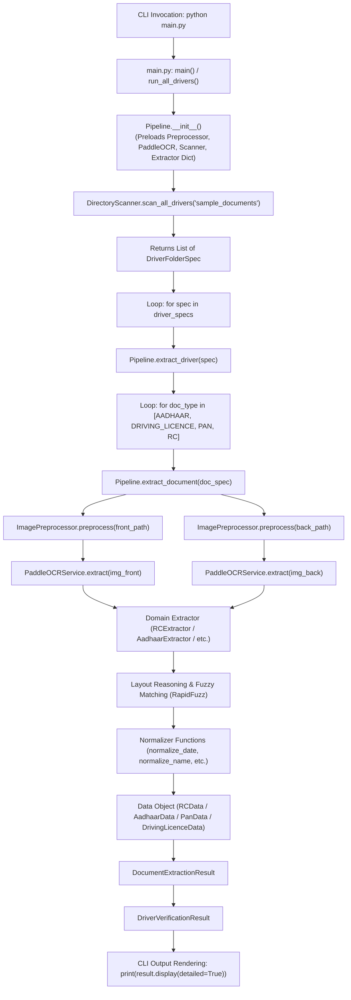

# Driver Document Verification System — Complete Data Flow & Architecture Documentation

This document provides a comprehensive, deep-dive explanation of the complete end-to-end data flow, execution pipeline, function calls, control transfers, image preprocessing, OCR engine processing, field-level extraction, layout reasoning, confidence scoring, and CLI output rendering in the **Driver Document Verification System**.

It is designed to serve as an authoritative, self-contained technical guide for developers, architects, or anyone new to the project.

---

## Table of Contents

1. [High-Level Architecture Overview](#1-high-level-architecture-overview)
2. [Project Folder Hierarchy & Input Structure](#2-project-folder-hierarchy--input-structure)
3. [End-to-End Data Flow Diagram](#3-end-to-end-data-flow-diagram)
4. [Phase-by-Phase Line & Control Flow Breakdown](#4-phase-by-phase-line--control-flow-breakdown)
   - [Phase 1: Entry Point & Pipeline Setup (`main.py` & `app/pipeline.py`)](#phase-1-entry-point--pipeline-setup-mainpy--apppipelinepy)
   - [Phase 2: Directory Scanning & Specification Building (`app/services/directory_scanner.py`)](#phase-2-directory-scanning--specification-building-appservicesdirectory_scannerpy)
   - [Phase 3: Driver-by-Driver Orchestration (`extract_driver`)](#phase-3-driver-by-driver-orchestration-extract_driver)
   - [Phase 4: Image Preprocessing & Orientation Correction (`app/ocr/preprocessor.py`)](#phase-4-image-preprocessing--orientation-correction-appocrpreprocessorpy)
   - [Phase 5: PaddleOCR Text Recognition (`app/ocr/paddle_ocr.py`)](#phase-5-paddleocr-text-recognition-appocrpaddle_ocrpy)
   - [Phase 6: Field Extraction & Layout Reasoning (`app/services/*/extractor.py`)](#phase-6-field-extraction--layout-reasoning-appservicesextractorpy)
   - [Phase 7: Data Normalization (`app/utils/normalizer.py`)](#phase-7-data-normalization-apputilsnormalizerpy)
   - [Phase 8: Output Assembly & CLI Display Rendering (`app/models/driver_models.py`)](#phase-8-output-assembly--cli-display-rendering-appmodelsdriver_modelspy)
5. [Extracted Fields Summary per Document Type](#5-extracted-fields-summary-per-document-type)
6. [Summary Module Registry](#6-summary-module-registry)

---

## 1. High-Level Architecture Overview

The Driver Document Verification System is a modular, field-aware OCR document extraction framework built in Python using OpenCV, PaddleOCR, RapidFuzz, and Pydantic.

### Key Architectural Concepts:
- **Driver-by-Driver Processing Flow**: The system processes documents grouped by driver directory (`sample_documents/<DRIVER_ID>/`) rather than processing all Aadhaar cards first, all RCs second, etc. All documents belonging to a single driver are evaluated sequentially before moving to the next driver.
- **Strict Processing Order**: Within each driver folder, documents are evaluated in a fixed mandatory hierarchy:
  $$\text{Aadhaar Card} \longrightarrow \text{Driving Licence} \longrightarrow \text{PAN Card} \longrightarrow \text{RC (Registration Certificate)}$$
- **Separate Front & Back Side Isolation**: Documents with two sides (such as RC smart cards or Aadhaar) are preprocessed and OCR'd independently to prevent spatial bounding box contamination between front and back images.
- **Field-Level Layout Reasoning**: Instead of hardcoding bounding box pixel locations (which fail on different card variants), extractors use bounding box geometry, label-proximity scoring, RapidFuzz fuzzy label matching ($\ge 85\%$ ratio), format validation, and side priority.
- **Confidence & Uncertainty Engine**: Computes normalized confidence scores ($0\%\text{--}100\%$) and uncertainty ratings (`HIGH`, `MEDIUM`, `LOW/UNCERTAIN`) for each extracted field based on OCR confidence and spatial layout alignment.

---

## 2. Project Folder Hierarchy & Input Structure

The project expects driver document directories structured as follows:

```text
sample_documents/
│
├── DRIVER_001/                  # Driver folder named by ID
│   ├── aadhar_card/
│   │   ├── front.jpg            # Aadhaar Front Image
│   │   └── back.jpg             # Aadhaar Back Image
│   │
│   ├── licence/
│   │   ├── front.jpg            # Driving Licence Front Image
│   │   └── back.jpg             # Driving Licence Back Image
│   │
│   ├── pan_card/
│   │   └── front.jpg            # PAN Card Image
│   │
│   └── rc/
│       ├── front.jpg            # Vehicle RC Front Image
│       └── back.jpg             # Vehicle RC Back Image
│
└── 9974848297/                  # Driver folder named by Mobile Number
    ├── aadhar_card/ ...
    ├── licence/ ...
    ├── pan_card/ ...
    └── rc/ ...
```

---

## 3. End-to-End Data Flow Diagram



---

## 4. Phase-by-Phase Line & Control Flow Breakdown

### Phase 1: Entry Point & Pipeline Setup (`main.py` & `app/pipeline.py`)

1. **User runs command in terminal**:
   ```bash
   python main.py
   # OR
   python main.py sample_documents/9974848297
   ```

2. **Execution begins in [main.py](file:///c:/Users/parik/OneDrive/Desktop/Driver_Verification/main.py)**:
   - Line 135: `if __name__ == "__main__":` block triggers.
   - Line 139: `pipeline = Pipeline()` instantiates the master orchestrator.

3. **`Pipeline.__init__()` in [app/pipeline.py](file:///c:/Users/parik/OneDrive/Desktop/Driver_Verification/app/pipeline.py#L65-L75)** executes:
   - `self._preprocessor = ImagePreprocessor()` initializes image loader, deskewer, quality analyzer, and contrast enhancer.
   - `self._ocr = PaddleOCRService()` lazy-loads the PaddleOCR engine (`use_angle_cls=True`, English model).
   - `self._detector = DocTypeDetector()` loads regex & text keyword classification rules.
   - `self._scanner = DirectoryScanner()` loads document directory discovery rules.
   - `self._extractors` dictionary preloads instances of `AadhaarExtractor`, `PanExtractor`, `DrivingLicenceExtractor`, and `RCExtractor`.

4. **CLI argument parsing in [main.py](file:///c:/Users/parik/OneDrive/Desktop/Driver_Verification/main.py#L143-L151)**:
   - If no argument is provided, `run_all_drivers(pipeline, "sample_documents")` is called.
   - If a specific driver path (e.g., `sample_documents/9974848297`) is passed, `run_driver(pipeline, path)` is called.

---

### Phase 2: Directory Scanning & Specification Building (`app/services/directory_scanner.py`)

1. **`DirectoryScanner.scan_driver_folder(folder_path)`** executes:
   - Reads the directory name (e.g. `9974848297` or `DRIVER_001`) as `driver_id`.
   - Checks subdirectories matching patterns for each document type:
     - Aadhaar: `aadhar_card/`, `aadhaar_card/`, `aadhar/`, `aadhaar/`
     - Licence: `licence/`, `license/`, `driving_licence/`, `dl/`
     - PAN: `pan_card/`, `pan/`
     - RC: `rc/`, `rc_book/`, `rc_card/`, `registration_certificate/`
   - Scans image files (`.jpg`, `.jpeg`, `.png`, `.webp`) inside each document folder.
   - Identifies front image (`front.jpg`, `f.jpg`, `1.jpg`) and back image (`back.jpg`, `b.jpg`, `2.jpg`).
   - Builds a `DriverFolderSpec` object containing 4 `DocumentFilesSpec` items (one per document type).

---

### Phase 3: Driver-by-Driver Orchestration (`extract_driver`)

1. **`Pipeline.extract_driver(spec)` in [app/pipeline.py](file:///c:/Users/parik/OneDrive/Desktop/Driver_Verification/app/pipeline.py#L88-L114)** executes:
   - Instantiates an empty `DriverVerificationResult(driver_id=spec.driver_id)`.
   - Iterates through `MANDATORY_DOC_ORDER`:
     ```python
     MANDATORY_DOC_ORDER = [
         DocumentType.AADHAAR,
         DocumentType.DRIVING_LICENCE,
         DocumentType.PAN,
         DocumentType.RC,
     ]
     ```
   - For each `doc_type`, calls `self.extract_document(doc_spec)`.

---

### Phase 4: Image Preprocessing & Orientation Correction (`app/ocr/preprocessor.py`)

When `extract_document` runs, `ImagePreprocessor.preprocess(image_path)` processes front and back images independently:

1. **Image Loading (`_load_image`)**:
   - Accepts file paths, raw bytes, base64 strings, or NumPy BGR arrays.
   - Reads image via OpenCV `cv2.imread()`. If OpenCV fails (e.g. Unicode path), falls back to PIL `Image.open()`.

2. **EXIF Orientation Fix (`_fix_exif_orientation`)**:
   - Inspects EXIF tag `Orientation` (common in mobile photos).
   - If photo was taken sideways or upside down, applies rotation (`cv2.ROTATE_90_CLOCKWISE`, `cv2.ROTATE_180`, etc.).

3. **Document-Level Rotation Correction (`_correct_document_rotation`)**:
   - Evaluates 0°, 90°, 180°, and 270° orientations using **Horizontal Projection Profile Variance** (`_projection_variance`).
   - Text oriented horizontally produces high projection variance across rows. If a rotated candidate produces $>15\%$ higher variance, the image is rotated to right-side up.

4. **Small Skew Angle Correction (`_correct_skew`)**:
   - Detects small angles ($<15^\circ$) using Canny Edge Detection + Probabilistic Hough Lines (`cv2.HoughLinesP`).
   - Rotates image via affine transformation matrix (`cv2.getRotationMatrix2D`).

5. **Image Quality Assessment (`ImageQualityReport`)**:
   - **Blur Score**: Calculates Laplacian Variance (`cv2.Laplacian(gray, cv2.CV_64F).var()`). Scores $<80.0$ flag `is_blurry = True`.
   - **Brightness**: Computes mean pixel brightness across V channel in HSV. $<55.0$ flags `is_too_dark = True`; $>215.0$ flags `is_too_bright = True`.
   - **Contrast Enhancement**: Applies CLAHE (Contrast Limited Adaptive Histogram Equalization) on L channel in LAB color space if contrast is low.

---

### Phase 5: PaddleOCR Text Recognition (`app/ocr/paddle_ocr.py`)

The preprocessed BGR image is sent to `PaddleOCRService.extract(img)`:

1. **OCR Engine Call**:
   - Invokes `self.ocr.ocr(img, cls=True)`.
   - Parameter `cls=True` runs PaddleOCR's text direction classifier.

2. **Raw Output Transformation**:
   - PaddleOCR returns polygon points for each detected text box along with recognised text and confidence score:
     ```text
     [[[x1, y1], [x2, y2], [x3, y3], [x4, y4]], ("GJ01SF5195", 0.9845)]
     ```
   - Converts points into `Point`, `BoundingBox`, and `OCRText` Pydantic models:
     - `min_x`, `max_x`, `min_y`, `max_y`, `width`, `height`, `center_x`, `center_y`.
   - Returns a structured `OCRResult` object containing all detected text boxes.

---

### Phase 6: Field Extraction & Layout Reasoning (`app/services/*/extractor.py`)

`Pipeline.extract_document` dispatches the `OCRResult` objects to the appropriate domain extractor:

#### Example: `RCExtractor` Execution Flow ([app/services/rc_extractor/extractor.py](file:///c:/Users/parik/OneDrive/Desktop/Driver_Verification/app/services/rc_extractor/extractor.py))

1. **Side-Isolated Extraction (`extract_rc(ocr_front, ocr_back)`)**:
   - Calls `_extract_side(ocr_front, side="front")` and `_extract_side(ocr_back, side="back")` separately.
   - Prevents back-side text boxes (like `SURAT`) from interfering with front-side labels (like `Owner Name`).

2. **Fuzzy Label Matching with RapidFuzz (`_find_all_matching_labels`)**:
   - Matches candidate text boxes against `_CANONICAL_RC_LABELS` using `fuzz.ratio` and `fuzz.token_set_ratio` with an $85\%$ similarity threshold.
   - Disambiguates label collisions (e.g. ensures `"Registration Date"` does not match `"Registration Validity"`).

3. **Candidate Spatial Scoring (`_evaluate_candidates_for_label`)**:
   - For a given label (e.g. `Owner Name`), evaluates nearby OCR text boxes:
     - **Inline Value Extraction**: Splits inline boxes like `Date of Reg. 13/05/2013` or `Owner Name REKHA` even when colons are missing.
     - **Same-Row (Right) Evaluation**: Checks horizontal alignment ($\pm 20\text{px}$) and measures distance.
     - **Below-Label Evaluation**: Checks vertical distance ($\le 140\text{px}$) and column center alignment bonus ($+30\text{pts}$).
     - **Multi-line Continuation Merging**: Merges multi-token names (`KAVINBHAI CHOKSI`), stopping if digits or structural labels are encountered.

4. **Structural Label Blacklisting & Plausibility Validation**:
   - `_is_plausible_owner_name()` blacklists labels like `SR.NO.`, `REG.NO.`, `SIGN`, `CHASSIS`, `ENGINE`, ensuring structural words are never extracted as names.
   - Truncates relation prefixes (`S/O`, `D/O`, `W/O`, `C/O`, `SON OF`).
   - Rejects noise words (`CYLINDER VALIDITY`) from `vehicle_type`.

5. **Form 23 Parivahan Printout Span Parsing (`_apply_form23_validity_spans`)**:
   - For paper RC printouts, parses regex pattern `valid from <start> to <end>` to populate registration date and validity.

6. **Field-Level Confidence & Uncertainty Calculation (`_calculate_overall_confidence`)**:
   - For each extracted field, calculates confidence:
     $$\text{field\_confidence} = 0.55 \times \text{ocr\_confidence} + 0.45 \times \text{layout\_match\_score}$$
   - Maps confidence to uncertainty ratings:
     - $\ge 85\% \longrightarrow$ `HIGH`
     - $65\text{--}84\% \longrightarrow$ `MEDIUM`
     - $< 65\% \longrightarrow$ `LOW / UNCERTAIN`
   - Computes `overall_confidence` as the average across all 5 extracted fields.

---

### Phase 7: Data Normalization (`app/utils/normalizer.py`)

All extracted raw text strings are passed through validation and normalization functions before assignment to data models:

1. **Date Normalization (`normalize_date`)**:
   - Converts Indian date formats (`13/05/2013`, `13-05-2013`, `04-Oct-2025`, `2026.05.15`) into ISO format: `YYYY-MM-DD`.

2. **Name Normalization (`normalize_name`)**:
   - Removes OCR artifacts/noise characters.
   - Cleans multi-spaces and converts to standard Title Case (e.g. `yogesh kumar meena` $\rightarrow$ `Yogesh Kumar Meena`).

3. **Document Number Normalization**:
   - `normalize_rc_number`: Formats All-India RC numbers (e.g. `GJ01SF5195` $\rightarrow$ `GJ-01-SF-5195`).
   - `normalize_dl_number`: Formats DL numbers (e.g. `RJ3420260005323` $\rightarrow$ `RJ34A20260005323`).
   - `normalize_aadhaar_number`: Formats 12-digit UID (`618136653442` $\rightarrow$ `6181 3665 3442`).
   - `normalize_pan_number`: Formats 10-char PAN (`hfrpm1721k` $\rightarrow$ `HFRPM1721K`).

---

### Phase 8: Output Assembly & CLI Display Rendering (`app/models/driver_models.py`)

1. **`DriverVerificationResult` Assembly**:
   - Stores `DocumentExtractionResult` for Aadhaar, Licence, PAN, and RC.

2. **Console Rendering (`print(result.display(detailed=True))`)**:
   - Formats clean terminal output.
   - Evaluates status (`[OK] extracted`, `[!] partial extraction`, `[-] missing document`).
   - Prints strictly the configured target fields for each document type alongside confidence metrics.

---

## 5. Extracted Fields Summary per Document Type

The system extracts and displays strictly the following target fields for each document:

| Document Type | Data Model Class | Extracted Fields |
| :--- | :--- | :--- |
| **Aadhaar Card** | [AadhaarData](file:///c:/Users/parik/OneDrive/Desktop/Driver_Verification/app/services/aadhaar_extractor/models.py) | `aadhaar_number`, `full_name`, `date_of_birth` |
| **Driving Licence** | [DrivingLicenceData](file:///c:/Users/parik/OneDrive/Desktop/Driver_Verification/app/services/driving_license_extractor/models.py) | `licence_number`, `full_name`, `date_of_birth`, `issue_date`, `expiry_date`, `vehicle_classes` |
| **PAN Card** | [PanData](file:///c:/Users/parik/OneDrive/Desktop/Driver_Verification/app/services/pan_extractor/models.py) | `pan_number`, `full_name`, `father_name`, `date_of_birth` |
| **RC (Registration Certificate)** | [RCData](file:///c:/Users/parik/OneDrive/Desktop/Driver_Verification/app/services/rc_extractor/models.py) | `registration_number`, `owner_name`, `vehicle_type`, `date_of_registration`, `registration_validity` |

---

## 6. Summary Module Registry

| File Path | Role & Main Class/Functions | Inputs | Outputs |
| :--- | :--- | :--- | :--- |
| [main.py](file:///c:/Users/parik/OneDrive/Desktop/Driver_Verification/main.py) | CLI Entry Point (`main`, `run_driver`, `run_all_drivers`) | Command Line Arguments | Triggers pipeline & prints formatted summary |
| [app/pipeline.py](file:///c:/Users/parik/OneDrive/Desktop/Driver_Verification/app/pipeline.py) | Orchestration Master (`Pipeline`) | Driver Folder Specs / Images | `DriverVerificationResult` |
| [app/services/directory_scanner.py](file:///c:/Users/parik/OneDrive/Desktop/Driver_Verification/app/services/directory_scanner.py) | Directory Scanner (`DirectoryScanner`) | Directory Path (`sample_documents`) | `DriverFolderSpec` list |
| [app/ocr/preprocessor.py](file:///c:/Users/parik/OneDrive/Desktop/Driver_Verification/app/ocr/preprocessor.py) | Image Preprocessor (`ImagePreprocessor`) | Raw Image File/Path/Bytes | Deskewed, rotated, enhanced BGR array + `ImageQualityReport` |
| [app/ocr/paddle_ocr.py](file:///c:/Users/parik/OneDrive/Desktop/Driver_Verification/app/ocr/paddle_ocr.py) | OCR Engine Wrapper (`PaddleOCRService`) | BGR Image Array | `OCRResult` with bounding boxes & text |
| [app/services/base_extractor.py](file:///c:/Users/parik/OneDrive/Desktop/Driver_Verification/app/services/base_extractor.py) | Abstract Base Extractor (`BaseExtractor`) | Bounding Box Geometry Helpers | Helper methods for spatial searching |
| [app/services/aadhaar_extractor/extractor.py](file:///c:/Users/parik/OneDrive/Desktop/Driver_Verification/app/services/aadhaar_extractor/extractor.py) | Aadhaar Field Extractor (`AadhaarExtractor`) | `OCRResult` | `AadhaarData` |
| [app/services/driving_license_extractor/extractor.py](file:///c:/Users/parik/OneDrive/Desktop/Driver_Verification/app/services/driving_license_extractor/extractor.py) | Licence Field Extractor (`DrivingLicenceExtractor`) | `OCRResult` | `DrivingLicenceData` |
| [app/services/pan_extractor/extractor.py](file:///c:/Users/parik/OneDrive/Desktop/Driver_Verification/app/services/pan_extractor/extractor.py) | PAN Field Extractor (`PanExtractor`) | `OCRResult` | `PanData` |
| [app/services/rc_extractor/extractor.py](file:///c:/Users/parik/OneDrive/Desktop/Driver_Verification/app/services/rc_extractor/extractor.py) | RC Field Extractor (`RCExtractor`) | `OCRResult` (Front & Back) | `RCData` with confidence & uncertainty metrics |
| [app/utils/normalizer.py](file:///c:/Users/parik/OneDrive/Desktop/Driver_Verification/app/utils/normalizer.py) | Text & Date Normalizer | Raw Text Strings | Clean ISO dates, standardized names, formatted doc numbers |
