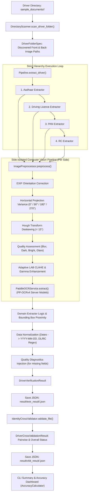

# Driver Document Verification System — Technical Architecture & Complete Reference Manual

**System Version**: 2.0 (Driver-by-Driver Modular Architecture)  
**Target Domain**: Ride-Hailing Driver Onboarding & KYC Automation (Rapido, Ola, Uber style)  
**Core Technologies**: Python 3.10+, OpenCV, PaddleOCR (PP-OCRv4 Server Weights), Pydantic, RapidFuzz, NumPy, Pillow  

---

## 📌 Table of Contents

1. [System Architecture & Data Flow](#1-system-architecture--data-flow)
   - [1.1 Architectural Principles](#11-architectural-principles)
   - [1.2 End-to-End Processing Lifecycle](#12-end-to-end-processing-lifecycle)
   - [1.3 Architecture Data Flow Diagram](#13-architecture-data-flow-diagram)
2. [Directory & Repository Structure](#2-directory--repository-structure)
3. [Deep-Dive Component Reference](#3-deep-dive-component-reference)
   - [3.1 Entry Points & CLI Runners (`main.py`, `cross_validate.py`, `result/calculate.py`)](#31-entry-points--cli-runners)
   - [3.2 Master Pipeline Orchestrator (`app/pipeline.py`)](#32-master-pipeline-orchestrator)
   - [3.3 Data Contracts & Domain Models (`app/models/`)](#33-data-contracts--domain-models)
   - [3.4 Image Preprocessing & OCR Engine (`app/ocr/`)](#34-image-preprocessing--ocr-engine)
   - [3.5 Image Straightening System (`app/image_straightener/`)](#35-image-straightening-system)
   - [3.6 Directory Scanner Service (`app/services/directory_scanner.py`)](#36-directory-scanner-service)
   - [3.7 Document Type Detector (`app/services/doc_type_detector.py`)](#37-document-type-detector)
   - [3.8 Shared Normalization Utilities (`app/utils/normalizer.py`)](#38-shared-normalization-utilities)
   - [3.9 Document-Specific Extractors (`app/services/`)](#39-document-specific-extractors)
     - [Base Extractor (`base_extractor.py`)](#base-extractor)
     - [Aadhaar Extractor (`aadhaar_extractor/`)](#aadhaar-extractor)
     - [PAN Extractor (`pan_extractor/`)](#pan-extractor)
     - [Driving Licence Extractor (`driving_license_extractor/`)](#driving-licence-extractor)
     - [RC Extractor & Manufacturer Repository (`rc_extractor/`)](#rc-extractor--manufacturer-repository)
   - [3.10 Identity Cross-Validator (`app/services/identity_cross_validator/`)](#310-identity-cross-validator)
   - [3.11 Accuracy Calculator & Dashboard (`result/accuracy_calculator.py`)](#311-accuracy-calculator--dashboard)
4. [Document Extraction Specifications & Data Dictionary](#4-document-extraction-specifications--data-dictionary)
5. [Storage Formats & Output JSON Schemas](#5-storage-formats--output-json-schemas)
6. [Usage & Execution Guide](#6-usage--execution-guide)

---

## 1. System Architecture & Data Flow

### 1.1 Architectural Principles

The Driver Document Verification System is engineered as a decoupled, multi-document verification pipeline specifically designed to process real-world identity and vehicle documents uploaded during ride-hailing driver onboarding:
- **Aadhaar Card** (Identity Proof / Address Verification)
- **Driving Licence (DL)** (Driving Authorization / Vehicle Category Authorization)
- **Permanent Account Number (PAN)** (Financial / Tax Identity Verification)
- **Registration Certificate (RC)** (Vehicle Ownership & Fitness Verification)

```
┌──────────────────────────────────────────────────────────────────────────────────────────┐
│                                CORE DESIGN PRINCIPLES                                    │
├──────────────────────────────────────────────────────────────────────────────────────────┤
│ 1. Driver-by-Driver Flow  : Documents are grouped and processed sequentially per driver.│
│ 2. Strict Hierarchy       : Aadhaar ──> Driving Licence ──> PAN Card ──> RC Book.        │
│ 3. Side-Isolated OCR      : Front and back images are preprocessed and OCR'd separately.│
│ 4. Spatial Reasoning      : Label-proximity bounding-box geometry over brittle regex.   │
│ 5. Semantic Validation    : Cross-field constraints (Issue Date < Expiry, Issue >= DOB). │
│ 6. Per-Field Diagnostics  : Missing fields provide actionable, human-readable reasons.  │
│ 7. Identity Cross-Check   : Pairwise fuzzy matching of Name & DOB across all documents. │
└──────────────────────────────────────────────────────────────────────────────────────────┘
```

---

### 1.2 End-to-End Processing Lifecycle

1. **Discovery & Ingestion**:
   [`DirectoryScanner`](file:///c:/Users/parik/OneDrive/Desktop/Driver_Verification/app/services/directory_scanner.py) crawls the target directory (`sample_documents/`), discovers driver folders, and resolves front/back image file paths into structured `DriverFolderSpec` objects.
2. **Sequential Orchestration**:
   [`Pipeline.extract_driver`](file:///c:/Users/parik/OneDrive/Desktop/Driver_Verification/app/pipeline.py#L90) iterates over each document in mandatory order (`AADHAAR` $\rightarrow$ `DRIVING_LICENCE` $\rightarrow$ `PAN` $\rightarrow$ `RC`).
3. **Independent Side Preprocessing**:
   [`ImagePreprocessor`](file:///c:/Users/parik/OneDrive/Desktop/Driver_Verification/app/ocr/preprocessor.py) loads front and back images, resolves EXIF orientation tags, executes Otsu horizontal projection variance rotation correction ($0^\circ, 90^\circ, 180^\circ, 270^\circ$), performs Hough line skew correction ($<15^\circ$), assesses image quality (blur, darkness, glare), and applies adaptive LAB CLAHE / gamma enhancement.
4. **PP-OCRv4 Neural Inference**:
   [`PaddleOCRService`](file:///c:/Users/parik/OneDrive/Desktop/Driver_Verification/app/ocr/paddle_ocr.py) runs high-accuracy server weights (`ch_PP-OCRv4_det_server_infer`, `en_PP-OCRv4_rec_server_infer`, `ch_ppocr_mobile_v2.0_cls_infer`) with `rec_image_shape="3,64,320"`, extracts bounding polygon points, filters confidence, and sorts text boxes spatially (top-to-bottom, left-to-right).
5. **Domain Extraction & Spatial Layout Reasoning**:
   The designated extractor parses field data using 2D geometric proximity, RapidFuzz label matching ($\ge 85\%$), inline prefix stripping, and structural blacklist protection.
6. **Data Normalization & Diagnostic Generation**:
   Raw text is standardized via [`normalizer.py`](file:///c:/Users/parik/OneDrive/Desktop/Driver_Verification/app/utils/normalizer.py) (Dates $\rightarrow$ ISO `YYYY-MM-DD`, Sarathi DL $\rightarrow$ `SS-RR-YYYY-NNNNNNN`, RC $\rightarrow$ `SS-RR-XX-NNNN`). For unextracted fields, specific image-quality and OCR diagnostics are generated.
7. **JSON Persistence**:
   The full driver record is serialized to `result/extr_result/<driver_id>.json`.
8. **Identity Cross-Validation**:
   [`IdentityCrossValidator`](file:///c:/Users/parik/OneDrive/Desktop/Driver_Verification/app/services/identity_cross_validator/cross_validator.py) compares Name (RapidFuzz token sort ratio) and DOB (exact match) across all document pairs (Aadhaar $\leftrightarrow$ PAN, Aadhaar $\leftrightarrow$ Licence, PAN $\leftrightarrow$ Licence) and writes validation results to `result/vldt_result/<driver_id>.json`.

---

### 1.3 Architecture Data Flow Diagram



---

## 2. Directory & Repository Structure

```
Driver_Verification/
├── main.py                                      # Primary CLI runner (Driver-by-Driver flow)
├── cross_validate.py                            # Standalone identity cross-validation runner
├── requirements.txt                             # Production Python dependencies
├── PROJECT_DOCUMENTATION.md                     # This complete technical documentation
├── DATA_FLOW_DOCUMENTATION.md                   # Step-by-step control & execution trace
├── project_review.md                            # Comprehensive production audit criteria
├── report.md                                    # Production readiness audit report & findings
│
├── models/                                      # Pre-trained neural network inference weights
│   ├── det_server/
│   │   └── ch_PP-OCRv4_det_server_infer/        # Server text detection model (DBNet)
│   ├── rec_server/
│   │   └── en_PP-OCRv4_rec_server_infer/        # Server English recognition model (SVTR-LCNet)
│   └── cls/
│       └── ch_ppocr_mobile_v2.0_cls_infer/      # Text angle classification model
│
├── app/                                         # Application source code package
│   ├── __init__.py
│   ├── pipeline.py                              # Master Pipeline orchestrator & result models
│   │
│   ├── config/                                  # Repository configurations & lookups
│   │   ├── known_manufacturers.json             # Vehicle manufacturer lookup repository
│   │   └── rc_config.json                       # Vehicle types, fuel types, body categories
│   │
│   ├── models/                                  # Data contracts & Pydantic models
│   │   ├── ocr_models.py                        # Point, BoundingBox, OCRText, OCRResult, QualityReport
│   │   └── driver_models.py                     # DocumentExtractionResult, DriverVerificationResult
│   │
│   ├── ocr/                                     # Computer vision & OCR engine wrappers
│   │   ├── __init__.py
│   │   ├── preprocessor.py                      # Loading, EXIF, Projection Rotation, Deskew, CLAHE
│   │   └── paddle_ocr.py                        # PP-OCRv4 engine initialization & execution
│   │
│   ├── image_straightener/                      # Advanced document alignment system
│   │   ├── __init__.py
│   │   └── straightener.py                      # 2-stage orientation, perspective unwarp, fine deskew
│   │
│   ├── utils/                                   # Shared formatting & normalization utilities
│   │   ├── __init__.py
│   │   └── normalizer.py                        # Date, name, Aadhaar, DL, and RC normalizers
│   │
│   └── services/                                # Domain business logic & extractors
│       ├── __init__.py
│       ├── base_extractor.py                    # Base class with 2D spatial search algorithms
│       ├── doc_type_detector.py                 # Keyword-based document type classifier
│       ├── directory_scanner.py                 # Driver directory crawler & specification builder
│       │
│       ├── aadhaar_extractor/                   # Aadhaar Card processing service
│       │   ├── __init__.py
│       │   ├── extractor.py                     # AadhaarExtractor implementation
│       │   └── models.py                        # AadhaarData Pydantic model
│       │
│       ├── pan_extractor/                       # PAN Card processing service
│       │   ├── __init__.py
│       │   ├── extractor.py                     # PanExtractor implementation
│       │   └── models.py                        # PanData Pydantic model
│       │
│       ├── driving_license_extractor/           # Driving Licence processing service
│       │   ├── __init__.py
│       │   ├── extractor.py                     # DrivingLicenceExtractor & DLDateResolver
│       │   └── models.py                        # DrivingLicenceData Pydantic model
│       │
│       ├── rc_extractor/                        # Vehicle Registration Certificate service
│       │   ├── __init__.py
│       │   ├── extractor.py                     # RCExtractor with RapidFuzz layout reasoning
│       │   ├── manufacturer_repository.py       # Config-backed manufacturer soft lookup
│       │   └── models.py                        # RCData Pydantic model with confidence scores
│       │
│       └── identity_cross_validator/            # Identity matching & cross-verification service
│           ├── __init__.py
│           ├── cross_validator.py               # IdentityCrossValidator implementation
│           └── models.py                        # CrossValidation data contracts
│
├── result/                                      # Output artifacts & evaluation engine
│   ├── __init__.py
│   ├── accuracy_calculator.py                   # Extraction accuracy evaluation engine & dashboard
│   ├── calculate.py                             # Accuracy evaluation batch CLI runner
│   ├── extr_result/                             # Extracted driver JSON records (<driver_id>.json)
│   └── vldt_result/                             # Identity cross-validation JSON results
│
└── sample_documents/                            # Test driver directories (<driver_id>/...)
```

---

## 3. Deep-Dive Component Reference

### 3.1 Entry Points & CLI Runners

#### [`main.py`](file:///c:/Users/parik/OneDrive/Desktop/Driver_Verification/main.py)
Primary entry point for driver-by-driver document extraction.
- **`run_driver(pipeline: Pipeline, driver_folder: str)`**: Processes all 4 document categories for a single driver folder and prints detailed verification summaries.
- **`run_all_drivers(pipeline: Pipeline, base_dir: str = "sample_documents")`**: Discovers all driver folders in `base_dir`, processes each driver sequentially, and saves output JSON files.
- **`run_single_image(pipeline: Pipeline, image_path: str, doc_type=None)`**: Legacy runner for processing an isolated document image.
- **`main()`**: CLI argument dispatcher.

#### [`cross_validate.py`](file:///c:/Users/parik/OneDrive/Desktop/Driver_Verification/cross_validate.py)
Standalone runner for cross-verifying identity details across Aadhaar, PAN, and DL.
- **`print_driver_validation(res)`**: Formats human-readable pairwise verification comparisons (Aadhaar $\leftrightarrow$ PAN, Aadhaar $\leftrightarrow$ DL, PAN $\leftrightarrow$ DL) and overall status (`MATCHED`, `REVIEW`, `MISMATCH`).
- **`main()`**: Batch evaluates all extraction JSON files in `result/extr_result/` and outputs a comprehensive batch validation summary.

#### [`result/calculate.py`](file:///c:/Users/parik/OneDrive/Desktop/Driver_Verification/result/calculate.py)
Runs extraction on all driver folders and renders an ASCII completion dashboard via `AccuracyCalculator`.

---

### 3.2 Master Pipeline Orchestrator

#### [`app/pipeline.py`](file:///c:/Users/parik/OneDrive/Desktop/Driver_Verification/app/pipeline.py)
The central orchestrator connecting preprocessing, neural OCR inference, domain extraction, diagnostics injection, and JSON serialization.

```python
class Pipeline:
    def __init__(self):
        self._preprocessor = ImagePreprocessor()
        self._ocr = PaddleOCRService()
        self._detector = DocTypeDetector()
        self._scanner = DirectoryScanner()
        self._extractors = {
            DocumentType.AADHAAR: AadhaarExtractor(),
            DocumentType.PAN: PanExtractor(),
            DocumentType.DRIVING_LICENCE: DrivingLicenceExtractor(),
            DocumentType.RC: RCExtractor(),
        }
```

- **`extract_driver(driver_input: Union[str, DriverFolderSpec]) -> DriverVerificationResult`**:
  Executes verification across all documents for a single driver in strict order (`Aadhaar` $\rightarrow$ `DL` $\rightarrow$ `PAN` $\rightarrow$ `RC`), populates the `DriverVerificationResult`, and automatically writes output to `result/extr_result/<driver_id>.json`.
- **`extract_document(doc_spec: DocumentFilesSpec) -> DocumentExtractionResult`**:
  Handles independent front and back image loading, applies preprocessing and OCR per side, invokes side-aware domain extractors (`extract_aadhaar`, `extract_dl`, `extract_pan`, `extract_rc`), merges side data, injects image quality failure diagnostics, and assigns status (`EXTRACTED`, `PARTIAL`, `MISSING`, `FAILED`).
- **`_apply_quality_diagnostics(data, quality_front, quality_back)`**:
  Enriches missing field diagnostic reasons with image quality alerts (e.g., `"Front image is blurry (blur score: 42.1). No 12-digit number found in OCR text"`).

---

### 3.3 Data Contracts & Domain Models

#### [`app/models/ocr_models.py`](file:///c:/Users/parik/OneDrive/Desktop/Driver_Verification/app/models/ocr_models.py)
- **`Point`**: 2D coordinate model (`x: float`, `y: float`).
- **`BoundingBox`**: 4-point polygon model with properties: `min_x`, `max_x`, `min_y`, `max_y`, `center_x`, `center_y`, `width`, `height`.
- **`OCRText`**: Single recognized text token with `text: str`, `confidence: float`, and `bounding_box: BoundingBox`.
- **`OCRResult`**: Complete image OCR result containing `full_text: str` and `texts: List[OCRText]`.
- **`ImageQualityReport`**: Dataclass tracking focus sharpness (`blur_score`), luminosity (`brightness`), overexposure (`glare_percentage`), rotation (`rotation_applied`), and enhancement status (`was_enhanced`).

#### [`app/models/driver_models.py`](file:///c:/Users/parik/OneDrive/Desktop/Driver_Verification/app/models/driver_models.py)
- **`DocumentExtractionResult`**: Encapsulates single document status (`EXTRACTED`, `PARTIAL`, `MISSING`, `FAILED`), data payload (`AadhaarData`, `DrivingLicenceData`, `PanData`, `RCData`), quality reports, and warning messages.
- **`DriverVerificationResult`**: Consolidated record containing driver ID and all 4 document results. Implements `.display(detailed=True)` for console formatting and `.save_json(output_dir)` for disk serialization.

---

### 3.4 Image Preprocessing & OCR Engine

#### [`app/ocr/preprocessor.py`](file:///c:/Users/parik/OneDrive/Desktop/Driver_Verification/app/ocr/preprocessor.py)
Applies deterministic computer vision routines to standardize input images before neural inference:
- **Universal Ingestion (`_load_image`)**: Accepts local file paths, raw bytes, NumPy BGR arrays, or PIL Images.
- **EXIF Orientation Correction (`_fix_exif_orientation`)**: Inspects camera EXIF tags and applies lossless rotations to correct smartphone portrait/landscape offsets.
- **Horizontal Projection Profile Rotation (`_correct_document_rotation`)**: Evaluates row variance across $0^\circ, 90^\circ, 180^\circ, 270^\circ$ orientations to align text horizontally without requiring OCR.
- **Probabilistic Hough Line Deskewing (`_correct_skew`)**: Detects small skew angles ($<15^\circ$) via Canny edge detection and applies affine rotation warping.
- **Image Quality Assessment**: Computes Laplacian variance for blur ($<80.0$), mean brightness ($<55.0$ dark, $>215.0$ overexposed), and glare saturation percentage ($>250$ pixel intensity).
- **LAB CLAHE & Gamma Enhancement (`_enhance`)**: Applies Contrast Limited Adaptive Histogram Equalization on the Luminance (L) channel in LAB color space and gamma curve correction ($\gamma=1.6$) for underexposed documents.

#### [`app/ocr/paddle_ocr.py`](file:///c:/Users/parik/OneDrive/Desktop/Driver_Verification/app/ocr/paddle_ocr.py)
- **Model Configuration**: Initialized with high-capacity server weights:
  - Detection: `models/det_server/ch_PP-OCRv4_det_server_infer` (DBNet architecture)
  - Recognition: `models/rec_server/en_PP-OCRv4_rec_server_infer` (SVTR-LCNet architecture with `rec_image_shape="3,64,320"`)
  - Direction Classifier: `models/cls/ch_ppocr_mobile_v2.0_cls_infer`
- **Inference & Sorting (`extract`)**: Executes OCR inference, filters low-confidence tokens (`threshold=0.70`), and sorts bounding boxes top-to-bottom, left-to-right (`key=lambda t: (round(t.bounding_box.min_y / 15) * 15, t.bounding_box.min_x)`).

---

### 3.5 Image Straightening System

#### [`app/image_straightener/straightener.py`](file:///c:/Users/parik/OneDrive/Desktop/Driver_Verification/app/image_straightener/straightener.py)
An advanced document alignment module featuring:
1. **2-Stage Orientation Disambiguation**: Resolves horizontal vs. vertical axis via projection variance, then resolves $180^\circ$ upside-down ambiguity using keyword confidence matching against a 40-word common Indian document vocabulary.
2. **4-Point Corner Perspective Unwarping (`_perspective_crop`)**: Locates card contour boundaries and unwarps perspective distortion using homography transformation.
3. **Fine-Angle Deskewing (`_correct_fine_skew`)**: Fine-tunes alignment via Hough lines.

---

### 3.6 Directory Scanner Service

#### [`app/services/directory_scanner.py`](file:///c:/Users/parik/OneDrive/Desktop/Driver_Verification/app/services/directory_scanner.py)
Crawls directory structures to discover driver document sets:
- **`MANDATORY_DOC_ORDER`**: `[DocumentType.AADHAAR, DocumentType.DRIVING_LICENCE, DocumentType.PAN, DocumentType.RC]`.
- **Folder Pattern Matching**: Resolves folder names using fuzzy synonyms (e.g. `aadhar_card`, `aadhaar`, `licence`, `dl`, `pan_card`, `rc_book`).
- **Front/Back Pairing (`_find_front_back_images`)**: Detects front and back images using filename heuristics (`front`, `back`, `f`, `b`, `1`, `2`) with automatic fallback to alphabetical ordering.

---

### 3.7 Document Type Detector

#### [`app/services/doc_type_detector.py`](file:///c:/Users/parik/OneDrive/Desktop/Driver_Verification/app/services/doc_type_detector.py)
Lightweight keyword classifier routing single images to appropriate extractors:
- **`DocumentType` Enum**: `AADHAAR`, `PAN`, `DRIVING_LICENCE`, `RC`, `UNKNOWN`.
- **Multilingual Keyword Scoring**: Evaluates English, Hindi, and Gujarati markers (e.g., `uidai`, `आधार`, `આધાર`, `income tax department`, `driving licence`, `transport department`, `registration certificate`).

---

### 3.8 Shared Normalization Utilities

#### [`app/utils/normalizer.py`](file:///c:/Users/parik/OneDrive/Desktop/Driver_Verification/app/utils/normalizer.py)
Pure functions converting raw extracted text into standard formats:
- **Date Normalization (`normalize_date` / `normalize_dob`)**: Parses `DD-MM-YYYY`, `DD/MM/YYYY`, `YYYY-MM-DD`, `DD Mon YYYY`, `Mon DD, YYYY`, and 2-digit years into ISO `YYYY-MM-DD`.
- **Name Cleaning (`normalize_name`)**: Strips non-alphabetic noise, collapses whitespace, applies title casing, and standardizes full name strings.
- **Document Number Normalization**:
  - `normalize_aadhaar_number`: Formats 12 digits as `XXXX XXXX XXXX`.
  - `normalize_pan_number`: Standardizes to uppercase `AAAAA9999A`.
  - `normalize_dl_number`: Standardizes Sarathi DL format to `SS-RR-YYYY-NNNNNNN`.
  - `normalize_rc_number`: Standardizes State series (`SS-RR-XX-NNNN`) and BH series (`YY-BH-NNNN-XX`).

---

### 3.9 Document-Specific Extractors

```
┌──────────────────────────────────────────────────────────────────────────────────────────┐
│                                EXTRACTOR CAPABILITIES                                    │
├──────────────────────────────────────────────────────────────────────────────────────────┤
│ BaseExtractor    : 2D Euclidean distance, label-proximity search, bounding-box math     │
│ AadhaarExtractor : 12-digit UID, DOB proximity, Gender keywords, Name above DOB anchor   │
│ PanExtractor     : 10-char PAN regex, Father Name below label, Person Name below header  │
│ DLExtractor      : Sarathi DL format, DLDateResolver (Semantic issue/expiry), Classes    │
│ RCExtractor      : RapidFuzz label matching, Smart Card / Form 23 validity spans, Conf. │
└──────────────────────────────────────────────────────────────────────────────────────────┘
```

#### Base Extractor (`app/services/base_extractor.py`)
Provides geometric bounding-box proximity methods:
- **`find_value_near_label(texts, label_keywords, direction="auto", max_distance=400, same_row_tolerance=18)`**:
  Finds the nearest OCR text box situated to the right (`direction="right"`), below (`direction="below"`), or in natural reading order (`direction="auto"`) relative to a matching label bounding box.
- **`_find_label_box(texts, keywords)`**:
  Finds matching label OCR boxes using case-insensitive containment matching.

#### Aadhaar Extractor (`app/services/aadhaar_extractor/`)
- **`models.py` (`AadhaarData`)**: `aadhaar_number`, `full_name`, `date_of_birth`, `gender`, `field_diagnostics`.
- **`extractor.py` (`AadhaarExtractor`)**:
  - `extract_aadhaar_number`: Extracts 12 digits (`4-4-4` pattern or continuous sequence).
  - `extract_dob`: Matches inline DOB, label-proximity dates, and fallback YOB patterns (`1930 <= year <= 2026`).
  - `extract_gender`: Maps `MALE`, `FEMALE`, `TRANSGENDER` from English, Hindi, or Gujarati terms.
  - `extract_name_raw`: Extracts name using inline label checks, spatial layout anchors (text situated directly above the DOB/Gender line), or confidence-ranked plausible alphabetic candidates filtered against `_NAME_BLACKLIST`.
  - `extract_address`: Extracts multi-line residential address from card back side.

#### PAN Extractor (`app/services/pan_extractor/`)
- **`models.py` (`PanData`)**: `pan_number`, `full_name`, `father_name`, `date_of_birth`, `field_diagnostics`.
- **`extractor.py` (`PanExtractor`)**:
  - `extract_pan_number`: Matches `[A-Z]{5}[0-9]{4}[A-Z]`.
  - `extract_name_raw`: Extracts person name located below `"INCOME TAX DEPARTMENT"` header or near `"Name"` label (handles Layout A: label above value, and Layout B: value above label).
  - `extract_father_name_raw`: Extracts father's name below `"Father's Name"` label, ensuring value is distinct from person name.
  - `extract_dob`: Extracts date near `"Date of Birth"` label.

#### Driving Licence Extractor (`app/services/driving_license_extractor/`)
- **`models.py` (`DrivingLicenceData`)**: `licence_number`, `full_name`, `date_of_birth`, `issue_date`, `expiry_date`, `vehicle_classes: List[str]`, `field_diagnostics`.
- **`extractor.py` (`DrivingLicenceExtractor`)**:
  - `extract_licence_number`: Extracts all-India Sarathi format `SS-RR-YYYY-NNNNNNN`.
  - `extract_dob`: Locates date candidate nearest to DOB label with constraint $\text{Year} \le \text{CurrentYear} - 16$.
  - `extract_name_raw`: Extracts name near `"Name:"` / `"Holder Name"` or directly above `"S/O"` / `"Son of"` relation labels, protected by structural phrase rejection (`_NAME_BLACKLIST`).
  - `_resolve_issue_and_expiry_dates`: Resolves issue date and validity date using spatial label proximity and strict semantic validation:
    $$\text{DOB} < \text{Issue Date} \le \text{Current Date} < \text{Expiry Date}$$
  - `extract_vehicle_classes`: Extracts all authorized vehicle category codes (`MCWG`, `LMV`, `LMV-NT`, `LMV-CAB`, `HMV`, `TRANS`, `3W-CAB`, etc.) near date columns or vehicle class labels.

#### RC Extractor & Manufacturer Repository (`app/services/rc_extractor/`)
- **`models.py` (`RCData`)**: `registration_number`, `owner_name`, `vehicle_type`, `date_of_registration`, `registration_validity`, `confidence_scores: Dict[str, float]`, `overall_confidence: float`, `field_diagnostics`.
- **`manufacturer_repository.py` (`ManufacturerRepository`)**: Config-backed lookup (`known_manufacturers.json`) for vehicle manufacturer soft hints.
- **`extractor.py` (`RCExtractor`)**:
  - Multi-variant support: PVC Smart Card RC, Paper RC Book, and Parivahan Form 23 printouts.
  - RapidFuzz fuzzy label matching ($\ge 85\%$) across 60+ canonical RC label aliases.
  - Multi-line continuation box merging for owner names and body types.
  - Relation marker truncation (`S/O`, `D/O`, `W/O`, `C/O`) to isolate pure owner names.
  - Form 23 validity span parser (`"valid from ... to ..."`).
  - Field-level confidence calculation ($0\%\text{--}100\%$) and uncertainty rating (`HIGH`, `MEDIUM`, `LOW/UNCERTAIN`).

---

### 3.10 Identity Cross-Validator

#### [`app/services/identity_cross_validator/cross_validator.py`](file:///c:/Users/parik/OneDrive/Desktop/Driver_Verification/app/services/identity_cross_validator/cross_validator.py)
Cross-validates extracted identity details across documents:
- **Pairwise Verification**:
  1. **Aadhaar $\longleftrightarrow$ PAN**
  2. **Aadhaar $\longleftrightarrow$ Driving Licence**
  3. **PAN $\longleftrightarrow$ Driving Licence**
- **Validation Metrics**:
  - **Name Match**: RapidFuzz `token_sort_ratio` on normalized name strings:
    - $\ge 60.0\% \rightarrow$ `MATCH`
    - $50.0\% \le \text{score} < 60.0\% \rightarrow$ `REVIEW`
    - $< 50.0\% \rightarrow$ `MISMATCH`
  - **DOB Match**: Exact comparison of normalized ISO dates (`MATCH` / `MISMATCH`).
- **Overall Status Determination**: Assigns `overall_name_status`, `overall_dob_status`, and `overall_status` (`MATCHED`, `REVIEW`, `MISMATCH`) and saves validation output to `result/vldt_result/<driver_id>.json`.

---

### 3.11 Accuracy Calculator & Dashboard

#### [`result/accuracy_calculator.py`](file:///c:/Users/parik/OneDrive/Desktop/Driver_Verification/result/accuracy_calculator.py)
Evaluates extraction performance across driver sets and renders ASCII dashboards:
- Evaluates total drivers, total document cards, and field-level extraction rates.
- Aggregates unextracted field failure diagnostics across all processed documents.

---

## 4. Document Extraction Specifications & Data Dictionary

| Document | Target Field | Data Type | Target Normalization | Description & Validation Rules |
| :--- | :--- | :--- | :--- | :--- |
| **Aadhaar** | `aadhaar_number` | `str` | `XXXX XXXX XXXX` | 12-digit Unique Identification Authority of India (UIDAI) number. |
| **Aadhaar** | `full_name` | `str` | Title Case | Cardholder's full name extracted via label proximity or spatial anchor. |
| **Aadhaar** | `date_of_birth` | `str` | `YYYY-MM-DD` | Cardholder date of birth (or `YYYY-01-01` for year-only cards). |
| **Aadhaar** | `gender` | `str` | `MALE` / `FEMALE` / `TRANSGENDER` | Standardized cardholder gender. |
| **PAN** | `pan_number` | `str` | `AAAAA9999A` | 10-character alphanumeric Permanent Account Number. |
| **PAN** | `full_name` | `str` | Title Case | PAN cardholder's full name. |
| **PAN** | `father_name` | `str` | Title Case | Cardholder's father / parent name. |
| **PAN** | `date_of_birth` | `str` | `YYYY-MM-DD` | Cardholder date of birth. |
| **DL** | `licence_number` | `str` | `SS-RR-YYYY-NNNNNNN` | Standard Sarathi Indian Driving Licence number. |
| **DL** | `full_name` | `str` | Title Case | Licence holder name (protected against RTO office titles). |
| **DL** | `date_of_birth` | `str` | `YYYY-MM-DD` | Licence holder date of birth ($\text{Age} \ge 16$). |
| **DL** | `issue_date` | `str` | `YYYY-MM-DD` | Driving licence initial issuance date. |
| **DL** | `expiry_date` | `str` | `YYYY-MM-DD` | Driving licence validity / expiration date ($\text{Expiry} > \text{Issue}$). |
| **DL** | `vehicle_classes`| `List[str]` | Sorted Codes | Authorized vehicle categories (`MCWG`, `LMV`, `LMV-NT`, `LMV-CAB`, `TRANS`, etc.). |
| **RC** | `registration_number`| `str` | `SS-RR-XX-NNNN` / `YY-BH-NNNN-XX`| Motor vehicle registration plate number. |
| **RC** | `owner_name` | `str` | UPPERCASE | Registered vehicle owner name (relation markers stripped). |
| **RC** | `vehicle_type` | `str` | UPPERCASE | Vehicle class / body type (e.g. `MOTOR CAR`, `AUTORICKSHAW`, `LMV`). |
| **RC** | `date_of_registration`| `str` | `YYYY-MM-DD` | Initial vehicle registration date. |
| **RC** | `registration_validity`| `str` | `YYYY-MM-DD` | Registration certificate / fitness validity expiration date. |

---

## 5. Storage Formats & Output JSON Schemas

### 5.1 Extraction Result JSON (`result/extr_result/<driver_id>.json`)

```json
{
  "driver_id": "9974848297",
  "documents": {
    "aadhaar": {
      "document_type": "AADHAAR",
      "status": "EXTRACTED",
      "warning": null,
      "data": {
        "aadhaar_number": "XXXX XXXX 8297",
        "full_name": "Patel Jay Dhansukhbhai",
        "date_of_birth": "1995-11-20",
        "gender": "MALE",
        "field_diagnostics": {}
      }
    },
    "licence": {
      "document_type": "DRIVING_LICENCE",
      "status": "EXTRACTED",
      "warning": null,
      "data": {
        "licence_number": "GJ-01-2015-0012345",
        "full_name": "Patel Jay Dhansukhbhai",
        "date_of_birth": "1995-11-20",
        "issue_date": "2015-04-12",
        "expiry_date": "2035-11-19",
        "vehicle_classes": ["MCWG", "LMV"],
        "field_diagnostics": {}
      }
    },
    "pan": {
      "document_type": "PAN",
      "status": "EXTRACTED",
      "warning": null,
      "data": {
        "pan_number": "ABCDE1234F",
        "full_name": "Patel Jay Dhansukhbhai",
        "father_name": "Dhansukhbhai Patel",
        "date_of_birth": "1995-11-20",
        "field_diagnostics": {}
      }
    },
    "rc": {
      "document_type": "RC",
      "status": "EXTRACTED",
      "warning": null,
      "data": {
        "registration_number": "GJ-01-AB-1234",
        "owner_name": "PATEL JAY DHANSUKHBHAI",
        "vehicle_type": "MOTOR CAR",
        "date_of_registration": "2018-06-15",
        "registration_validity": "2033-06-14",
        "confidence_scores": {
          "registration_number": 0.98,
          "owner_name": 0.92,
          "date_of_registration": 0.96,
          "registration_validity": 0.96
        },
        "overall_confidence": 0.96,
        "field_diagnostics": {}
      }
    }
  }
}
```

---

### 5.2 Identity Cross-Validation JSON (`result/vldt_result/<driver_id>.json`)

```json
{
  "driver_id": "9974848297",
  "validation": {
    "aadhaar_vs_pan": {
      "name": {
        "aadhaar": "PATEL JAY DHANSUKHBHAI",
        "pan": "PATEL JAY DHANSUKHBHAI",
        "similarity": 100.0,
        "status": "MATCH"
      },
      "date_of_birth": {
        "aadhaar": "1995-11-20",
        "pan": "1995-11-20",
        "status": "MATCH"
      },
      "status": "MATCH"
    },
    "aadhaar_vs_licence": {
      "name": {
        "aadhaar": "PATEL JAY DHANSUKHBHAI",
        "licence": "PATEL JAY DHANSUKHBHAI",
        "similarity": 100.0,
        "status": "MATCH"
      },
      "date_of_birth": {
        "aadhaar": "1995-11-20",
        "licence": "1995-11-20",
        "status": "MATCH"
      },
      "status": "MATCH"
    },
    "pan_vs_licence": {
      "name": {
        "pan": "PATEL JAY DHANSUKHBHAI",
        "licence": "PATEL JAY DHANSUKHBHAI",
        "similarity": 100.0,
        "status": "MATCH"
      },
      "date_of_birth": {
        "pan": "1995-11-20",
        "licence": "1995-11-20",
        "status": "MATCH"
      },
      "status": "MATCH"
    },
    "overall_name_status": "MATCHED",
    "overall_dob_status": "MATCHED",
    "overall_status": "MATCHED"
  }
}
```

---

## 6. Usage & Execution Guide

### 6.1 Prerequisites & Installation

1. **Python Environment**: Python 3.10+ recommended.
2. **Install Dependencies**:
   ```bash
   pip install -r requirements.txt
   ```

---

### 6.2 CLI Command Reference

#### 1. Process All Drivers in `sample_documents/`
Processes all discovered driver folders driver-by-driver and writes output JSON files to `result/extr_result/`:
```bash
python main.py
```

#### 2. Process a Specific Driver Directory
```bash
python main.py sample_documents/9974848297
# OR
python main.py sample_documents/DRIVER_001
```

#### 3. Run Identity Cross-Validation
Batch cross-validates all extracted records in `result/extr_result/` and saves results to `result/vldt_result/`:
```bash
python cross_validate.py
```
To cross-validate a single driver by ID:
```bash
python cross_validate.py 9974848297
```

#### 4. Run Accuracy Evaluation Dashboard
Evaluates extraction rates and prints an ASCII summary table:
```bash
python result/calculate.py
```

#### 5. Process a Single Image (Legacy Mode)
```bash
# Auto-detect document type
python main.py path/to/document.jpg

# Force specific document type
python main.py path/to/licence.jpeg licence
python main.py path/to/pan.jpg pan
python main.py path/to/aadhaar.jpg aadhaar
python main.py path/to/rc.jpg rc
```

---

### 6.3 Programmatic Python API

```python
from app.pipeline import Pipeline

# 1. Initialize Pipeline (Pre-loads neural OCR models)
pipeline = Pipeline()

# 2. Extract an entire driver folder
driver_result = pipeline.extract_driver("sample_documents/9974848297")

# 3. Print human-readable summary
print(driver_result.display(detailed=True))

# 4. Access structured data
print(f"Driver ID       : {driver_result.driver_id}")
if driver_result.licence_result and driver_result.licence_result.data:
    dl_data = driver_result.licence_result.data
    print(f"DL Number       : {dl_data.licence_number}")
    print(f"DL Holder Name  : {dl_data.full_name}")
    print(f"DL Issue Date   : {dl_data.issue_date}")
    print(f"DL Expiry Date  : {dl_data.expiry_date}")
    print(f"Vehicle Classes : {', '.join(dl_data.vehicle_classes)}")

# 5. Access RC Confidence Metrics
if driver_result.rc_result and driver_result.rc_result.data:
    rc_data = driver_result.rc_result.data
    print(f"RC Reg Number   : {rc_data.registration_number}")
    print(f"Overall Conf.   : {rc_data.overall_confidence:.0%}")
```
