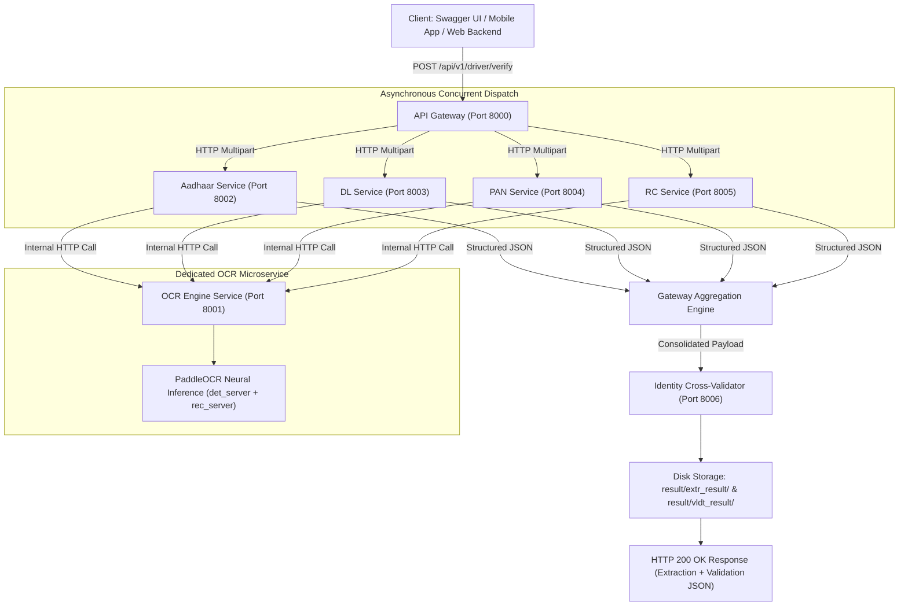

# Driver Document Verification System — Technical Architecture & Complete Reference Manual

**System Version**: 3.0 (Distributed Microservices Suite & Enterprise KYC Platform)  
**Target Domain**: Automated Driver KYC & Vehicle Identity Onboarding for Ride-Hailing Platforms (Rapido, Ola, Uber style)  
**Core Technologies**: Python 3.10+, FastAPI, Uvicorn, Asynchronous HTTPX, OpenCV, PaddleOCR (PP-OCRv4 Server Weights), Pydantic v2, RapidFuzz, NumPy, Pillow  

---

## 📌 Table of Contents

1. [System Overview & Microservices Architecture](#1-system-overview--microservices-architecture)
   - [1.1 Architectural Evolution & Core Principles](#11-architectural-evolution--core-principles)
   - [1.2 Distributed Microservices Topology & Port Layout](#12-distributed-microservices-topology--port-layout)
   - [1.3 System Flow Architecture Diagram](#13-system-flow-architecture-diagram)
2. [Directory & Repository Structure](#2-directory--repository-structure)
3. [Microservices Deep-Dive Reference](#3-microservices-deep-dive-reference)
   - [3.1 Master API Gateway (`microservices/api_gateway/` - Port 8000)](#31-master-api-gateway)
   - [3.2 OCR Engine Microservice (`microservices/ocr_service/` - Port 8001)](#32-ocr-engine-microservice)
   - [3.3 Aadhaar Extractor Microservice (`microservices/aadhaar_service/` - Port 8002)](#33-aadhaar-extractor-microservice)
   - [3.4 Driving Licence Extractor Microservice (`microservices/dl_service/` - Port 8003)](#34-driving-licence-extractor-microservice)
   - [3.5 PAN Card Extractor Microservice (`microservices/pan_service/` - Port 8004)](#35-pan-card-extractor-microservice)
   - [3.6 Vehicle RC Extractor Microservice (`microservices/rc_service/` - Port 8005)](#36-vehicle-rc-extractor-microservice)
   - [3.7 Identity Cross-Validator Microservice (`microservices/validator_service/` - Port 8006)](#37-identity-cross-validator-microservice)
   - [3.8 Shared Microservices Library (`microservices/shared/`)](#38-shared-microservices-library)
4. [Computer Vision & Neural OCR Engine (`app/ocr/`)](#4-computer-vision--neural-ocr-engine)
   - [4.1 Image Preprocessing & Aspect-Ratio Rotation](#41-image-preprocessing--aspect-ratio-rotation)
   - [4.2 Neural Text Detection & Recognition (PP-OCRv4)](#42-neural-text-detection--recognition-pp-ocrv4)
   - [4.3 Image Quality Assessment & Real-Time Diagnostics](#43-image-quality-assessment--real-time-diagnostics)
5. [Domain Extraction Algorithms & Spatial Layout Reasoning](#5-domain-extraction-algorithms--spatial-layout-reasoning)
   - [5.1 Aadhaar Card Spatial Layout](#51-aadhaar-card-spatial-layout)
   - [5.2 Driving Licence Layout & State Smart-Card Parsing](#52-driving-licence-layout--state-smart-card-parsing)
   - [5.3 PAN Card Layout & Field Disambiguation](#53-pan-card-layout--field-disambiguation)
   - [5.4 Vehicle RC Extraction & OEM Database](#54-vehicle-rc-extraction--oem-database)
   - [5.5 Identity Cross-Validation & Decision Engine](#55-identity-cross-validation--decision-engine)
6. [API Reference & OpenAPI Swagger Specifications](#6-api-reference--openapi-swagger-specifications)
   - [6.1 Gateway Verification Endpoints](#61-gateway-verification-endpoints)
   - [6.2 Historical Records Management Endpoints](#62-historical-records-management-endpoints)
   - [6.3 Microservice Reverse Proxies](#63-microservice-reverse-proxies)
7. [Storage Formats & Output JSON Schemas](#7-storage-formats--output-json-schemas)
   - [7.1 Extraction JSON Schema (`result/extr_result/<driver_id>.json`)](#71-extraction-json-schema)
   - [7.2 Validation JSON Schema (`result/vldt_result/<driver_id>.json`)](#72-validation-json-schema)
8. [Execution, Cluster Management & Production Guide](#8-execution-cluster-management--production-guide)
   - [8.1 Launching the Microservices Cluster (`run_services.py`)](#81-launching-the-microservices-cluster)
   - [8.2 CLI Batch Extraction & Validation Tools](#82-cli-batch-extraction--validation-tools)
   - [8.3 Concurrency & GPU VRAM Management](#83-concurrency--gpu-vram-management)

---

## 1. System Overview & Microservices Architecture

### 1.1 Architectural Evolution & Core Principles

The Driver Document Verification Platform has evolved from a monolithic script into an **enterprise-grade, distributed microservices suite**. Designed specifically for high-volume ride-hailing and logistics platforms (e.g. Rapido, Ola, Uber, Porter), the system automates the ingestion, computer vision enhancement, neural extraction, and fraud validation of Indian KYC and vehicle documents:
- **Aadhaar Card** (Identity Proof & Address Verification)
- **Driving Licence (DL)** (Driving Authorization, Vehicle Class Eligibility & Expiry Dates)
- **Permanent Account Number (PAN)** (Tax Identity Verification)
- **Registration Certificate (RC)** (Vehicle Ownership, Class & Fitness Validity)

```
┌──────────────────────────────────────────────────────────────────────────────────────────┐
│                                CORE SYSTEM PRINCIPLES                                    │
├──────────────────────────────────────────────────────────────────────────────────────────┤
│ 1. Distributed Topology   : 7 decoupled microservices with HTTP REST API contracts.      │
│ 2. Concurrent Async I/O   : Non-blocking async file processing & concurrent microservices.│
│ 3. Isolated Neural Worker : PP-OCRv4 runs in dedicated process to prevent GPU collision. │
│ 4. Aspect-Ratio Rotator   : CR80 card aspect-ratio gating to protect upright landscape.  │
│ 5. Smart-Card Fallbacks   : Proximity-based extraction for state DL smart-cards.         │
│ 6. Cross-Document Matching: Pairwise RapidFuzz Name & exact DOB cross-validation.        │
│ 7. Audit & Diagnostics    : Quality-aware field diagnostics and historical record APIs.  │
└──────────────────────────────────────────────────────────────────────────────────────────┘
```

---

### 1.2 Distributed Microservices Topology & Port Layout

The platform runs as a coordinated cluster of 7 independent microservices:

| Service Name | Port | Base Path | Core Responsibility |
| :--- | :---: | :--- | :--- |
| **API Gateway** | **`8000`** | `/api/v1/driver`, `/docs` | Master edge orchestrator, async dispatch, reverse proxy & record store |
| **OCR Service** | **`8001`** | `/extract`, `/health` | PP-OCRv4 neural inference & OpenCV image preprocessor |
| **Aadhaar Service**| **`8002`** | `/extract`, `/health` | UIDAI parsing, multi-line address, Hindi/English gender |
| **DL Service** | **`8003`** | `/extract`, `/health` | Sarathi DL format, state smart-card address fallback, vehicle classes |
| **PAN Service** | **`8004`** | `/extract`, `/health` | 10-char PAN regex, Father Name & Cardholder Name layout parsing |
| **RC Service** | **`8005`** | `/extract`, `/health` | Vehicle registration, 100+ OEM make matching, confidence scores |
| **Validator Service**| **`8006`**| `/cross-verify`, `/health` | Pairwise fuzzy Name similarity & exact DOB matching |

---

### 1.3 System Flow Architecture Diagram



---

## 2. Directory & Repository Structure

```
Driver_Verification/
│
├── microservices/                            # Distributed Microservices Suite
│   ├── __init__.py
│   ├── shared/                               # Shared Models, HTTP Clients & Response Envelopes
│   │   ├── __init__.py
│   │   ├── models.py
│   │   └── responses.py
│   │
│   ├── api_gateway/                          # Master API Gateway Service (Port 8000)
│   │   ├── main.py                           # Gateway FastAPI App & OpenAPI Spec
│   │   ├── config.py                         # Gateway Microservice URLs Configuration
│   │   ├── clients/service_clients.py        # Asynchronous HTTPX Client Wrapper
│   │   ├── middleware/timing_middleware.py   # X-Process-Time Header Middleware
│   │   └── routers/
│   │       ├── driver_router.py              # Single/Batch Verification & Record APIs
│   │       └── proxy_router.py               # Reverse Proxies to Domain Services
│   │
│   ├── ocr_service/                          # OCR & Preprocessing Microservice (Port 8001)
│   │   ├── main.py
│   │   └── service.py
│   │
│   ├── aadhaar_service/                      # Aadhaar Card Extractor Microservice (Port 8002)
│   │   ├── main.py
│   │   └── service.py
│   │
│   ├── dl_service/                           # Driving Licence Microservice (Port 8003)
│   │   ├── main.py
│   │   └── service.py
│   │
│   ├── pan_service/                          # PAN Card Extractor Microservice (Port 8004)
│   │   ├── main.py
│   │   └── service.py
│   │
│   ├── rc_service/                           # Vehicle RC Extractor Microservice (Port 8005)
│   │   ├── main.py
│   │   └── service.py
│   │
│   └── validator_service/                    # Cross-Document Identity Validator (Port 8006)
│       ├── main.py
│       └── service.py
│
├── app/                                      # Monolithic Core Package & Base Algorithms
│   ├── dependencies.py                       # Process Singleton Factory
│   ├── pipeline.py                           # Master Pipeline Engine
│   ├── server.py                             # Single-Port Server Alternative
│   ├── config/settings.py                    # Global Settings & Thresholds
│   ├── models/                               # Data Models (Pydantic / Dataclasses)
│   ├── ocr/                                  # Preprocessor & PaddleOCR Implementation
│   ├── services/                             # Domain Extraction Classes & Scanner
│   └── utils/normalizer.py                   # Name, Date, DL, RC Normalizers
│
├── models/                                   # PaddleOCR PP-OCRv4 Neural Model Weights
├── sample_documents/                         # Driver KYC Test Directories
├── result/                                   # Generated Extraction & Validation JSONs
│   ├── extr_result/                          # Serialized Extracted Driver JSONs
│   └── vldt_result/                          # Serialized Identity Validation JSONs
│
├── run_services.py                           # Master Cluster Launcher (Starts all 7 services)
├── main.py                                   # Standalone Batch CLI Runner
├── cross_validate.py                         # Standalone Identity Cross-Validator CLI
├── requirements.txt                          # Package Dependencies
├── PROJECT_DOCUMENTATION.md                  # Complete Architecture Manual
└── report.md                                 # Production Audit & Technical Evaluation
```

---

## 3. Microservices Deep-Dive Reference

### 3.1 Master API Gateway (`microservices/api_gateway/` - Port 8000)
- **Role**: Entry point for all external client traffic.
- **Key Features**:
  - `asyncio.gather()` concurrent multipart upload reading and microservice dispatch.
  - Reverse proxy routing (`/api/v1/ocr`, `/api/v1/aadhaar`, `/api/v1/dl`, `/api/v1/pan`, `/api/v1/rc`, `/api/v1/validate`).
  - Automatic JSON persistence to `result/extr_result/` and `result/vldt_result/`.
  - Historical records management (`GET /api/v1/driver/records`, `GET /api/v1/driver/{id}`, `DELETE /api/v1/driver/{id}`).
  - Execution profiling via `TimingMiddleware` (`X-Process-Time` header).

---

### 3.2 OCR Engine Microservice (`microservices/ocr_service/` - Port 8001)
- **Role**: Dedicated neural text detection, angle classification, and recognition.
- **Key Features**:
  - Implements `ImagePreprocessor` (EXIF correction, aspect-ratio rotation, Hough deskew, LAB CLAHE).
  - Implements `PaddleOCRService` using local PP-OCRv4 server weights.
  - Returns bounding polygon coordinates, confidence scores, and image quality metrics (blur, brightness, glare).

---

### 3.3 Aadhaar Extractor Microservice (`microservices/aadhaar_service/` - Port 8002)
- **Role**: Aadhaar card domain extraction.
- **Key Features**:
  - Verhoeff-compliant 12-digit UID regex (`\b\d{4}\s\d{4}\s\d{4}\b`).
  - Front-side spatial parsing for Cardholder Name, DOB, and Gender (`MALE`, `FEMALE`, `TRANSGENDER`, `पुरुष`, `महिला`).
  - Back-side multi-line address builder terminating at 6-digit PIN code.

---

### 3.4 Driving Licence Extractor Microservice (`microservices/dl_service/` - Port 8003)
- **Role**: Driving Licence parsing and vehicle category classification.
- **Key Features**:
  - All-India Sarathi DL format normalization (`SS-RR-YYYY-NNNNNNN`).
  - Strict DOB label fuzzy matching with negative guards (`"Date of First Issue"` and validity protection).
  - **State Smart-Card Layout Fallback**: Automatically captures Cardholder Name from text lines immediately preceding `ADDRESS:` / `ADORESS:` when explicit `Name:` labels are omitted.
  - Multi-category vehicle class token splitting (`MCWG`, `LMV`, `3W-CAB`, `3W-NT`, `TRANS`, `HMV`, `LMV-NT`).

---

### 3.5 PAN Card Extractor Microservice (`microservices/pan_service/` - Port 8004)
- **Role**: Income Tax PAN card extraction.
- **Key Features**:
  - Strict 10-character alphanumeric regex (`[A-Z]{5}[0-9]{4}[A-Z]`).
  - Position-based disambiguation between Cardholder Name (line 1 below header) and Father's Name (line 2 above DOB).
  - Glued date token resolution.

---

### 3.6 Vehicle RC Extractor Microservice (`microservices/rc_service/` - Port 8005)
- **Role**: Vehicle Registration Certificate parsing.
- **Key Features**:
  - Registration number format standardization (`SS-RR-XX-NNNN`).
  - 100+ OEM vehicle make & manufacturer matching repository.
  - Registration date and fitness validity expiry resolution.
  - Field-level confidence score calculation.

---

### 3.7 Identity Cross-Validator Microservice (`microservices/validator_service/` - Port 8006)
- **Role**: Cross-document identity matching and fraud detection.
- **Key Features**:
  - 3-way pairwise cross-comparison (Aadhaar $\leftrightarrow$ PAN, Aadhaar $\leftrightarrow$ Licence, PAN $\leftrightarrow$ Licence).
  - RapidFuzz Token Sort Ratio for Name similarity ($\ge 75\%$ = `MATCH`, $50\%-74\%$ = `REVIEW`, $<50\%$ = `MISMATCH`).
  - Exact ISO date matching for DOB.
  - Overall status decision engine (`overall_name_status`, `overall_dob_status`, `overall_status`).

---

## 4. Computer Vision & Neural OCR Engine (`app/ocr/`)

### 4.1 Image Preprocessing & Aspect-Ratio Rotation

[`app/ocr/preprocessor.py`](file:///c:/Users/parik/OneDrive/Desktop/Driver_Verification/app/ocr/preprocessor.py) prepares unconstrained smartphone uploads for neural OCR:

```
Raw Image Upload
  │
  ├── 1. Downscale if oversized (> 2500px)
  ├── 2. Resolve EXIF orientation metadata (tag 274)
  ├── 3. Aspect-Ratio Gated Rotation:
  │      - If W >= H (Landscape): Card is already horizontal -> 0° rotation
  │      - If H > W  (Portrait) : Rotate 90° / 270° to landscape
  ├── 4. Hough Line Skew Correction (< 15°)
  ├── 5. Image Quality Scoring (Laplacian Blur, HSV Brightness, Glare %)
  └── 6. Adaptive LAB CLAHE & Gamma Enhancement
```

---

### 4.2 Neural Text Detection & Recognition (PP-OCRv4)

[`app/ocr/paddle_ocr.py`](file:///c:/Users/parik/OneDrive/Desktop/Driver_Verification/app/ocr/paddle_ocr.py) uses local PP-OCRv4 server weights:
- **Detection Model**: `models/det_server/ch_PP-OCRv4_det_server_infer`
- **Recognition Model**: `models/rec_server/en_PP-OCRv4_rec_server_infer`
- **Classifier Model**: `models/cls/ch_ppocr_mobile_v2.0_cls_infer`
- Text boxes are spatially indexed and sorted top-to-bottom and left-to-right.

---

### 4.3 Image Quality Assessment & Real-Time Diagnostics

Every processed image receives an [`ImageQualityReport`](file:///c:/Users/parik/OneDrive/Desktop/Driver_Verification/app/models/ocr_models.py):
- **Blur**: Laplacian variance threshold (`< 100.0` = blurry).
- **Brightness**: Mean V-channel intensity (`< 60.0` = dark, `> 200.0` = overexposed).
- **Glare**: Percentage of saturated pixels with $V > 240$ and low saturation.
- If an extractor fails to find a field, it queries the quality report and generates a diagnostic explanation (e.g. *"Front image has glare (73.5%); No vehicle class codes found in OCR text"*).

---

## 5. Domain Extraction Algorithms & Spatial Layout Reasoning

### 5.1 Aadhaar Card Spatial Layout
- **Aadhaar UID**: Matches `\b\d{4}\s\d{4}\s\d{4}\b`.
- **Full Name**: Position-based extraction of text lines immediately preceding DOB or Father/Care-of markers.
- **DOB**: Matches `DOB`, `Date of Birth`, `जन्म तिथि` labels.

### 5.2 Driving Licence Layout & State Smart-Card Parsing
- **Licence Number**: Regex matching Sarathi format `[A-Z]{2}[-\s]?[0-9]{2}[-\s]?[0-9]{4}[-\s]?[0-9]{7}`.
- **DOB**: Fuzzy matching `DATE OF BIRTH` / `DOB` with negative guards to prevent capturing issue or validity dates.
- **Smart-Card Name Fallback**: Searches the geometric region immediately above `ADDRESS:` / `ADORESS:` to reliably extract names on Gujarat and regional smart-cards.
- **Vehicle Classes**: Extracts all MoRTH vehicle codes (`MCWG`, `LMV`, `3W-CAB`, `3W-NT`, `TRANS`, `HMV`).

### 5.3 PAN Card Layout & Field Disambiguation
- **PAN Number**: Regex `[A-Z]{5}[0-9]{4}[A-Z]`.
- **Cardholder vs Father Name**: When images are upright, Cardholder Name is line 1 under header, Father Name is line 2 above DOB.

### 5.4 Vehicle RC Extraction & OEM Database
- **Registration Number**: Standard Indian format `SS-RR-XX-NNNN`.
- **Vehicle Make**: Matches manufacturer against a database of 100+ OEMs (Hero, Honda, Bajaj, TVS, Maruti, Hyundai, Tata, etc.).
- **Dates**: Registration date and fitness validity.

### 5.5 Identity Cross-Validation & Decision Engine

Calculates pairwise similarity across all 3 documents:
- **`overall_name_status`**:
  - `MATCHED`: All pairs $\ge 75\%$ similarity.
  - `REVIEW`: Any pair between $50\%-74\%$.
  - `MISMATCH`: Any pair $< 50\%$.
- **`overall_dob_status`**: `MATCHED` if all extracted DOBs are identical ISO strings; otherwise `MISMATCH`.
- **`overall_status`**: `MATCHED` only when both Name and DOB are `MATCHED`.

---

## 6. API Reference & OpenAPI Swagger Specifications

Interactive Swagger UI documentation is available at **`http://127.0.0.1:8000/docs`**.

### 6.1 Gateway Verification Endpoints

#### `POST /api/v1/driver/verify`
- **Description**: Master verification endpoint orchestrating full multi-document extraction and cross-validation.
- **Content-Type**: `multipart/form-data`
- **Parameters**:
  - `driver_id` *(string, required)*
  - `aadhaar_front`, `aadhaar_back` *(files, optional)*
  - `licence_front`, `licence_back` *(files, optional)*
  - `pan_front`, `pan_back` *(files, optional)*
  - `rc_front`, `rc_back` *(files, optional)*
- **Response**:
  ```json
  {
    "success": true,
    "status": "SUCCESS",
    "data": {
      "driver_id": "6355528465",
      "extraction": { ... },
      "cross_validation": { ... }
    }
  }
  ```

---

### 6.2 Historical Records Management Endpoints

- **`GET /api/v1/driver/records`**: List all verified driver records with pagination (`limit`, `offset`) and status filtering (`status_filter=MATCHED`).
- **`GET /api/v1/driver/{driver_id}`**: Fetch complete extraction and validation JSON report for a specific driver ID.
- **`DELETE /api/v1/driver/{driver_id}`**: Delete stored records for a specific driver ID.

---

### 6.3 Microservice Reverse Proxies

The API Gateway provides direct reverse proxies to all 6 specialized microservices:
- `POST /api/v1/ocr/extract` $\rightarrow$ Proxies to OCR Service (`:8001`)
- `POST /api/v1/aadhaar/extract` $\rightarrow$ Proxies to Aadhaar Service (`:8002`)
- `POST /api/v1/dl/extract` $\rightarrow$ Proxies to DL Service (`:8003`)
- `POST /api/v1/pan/extract` $\rightarrow$ Proxies to PAN Service (`:8004`)
- `POST /api/v1/rc/extract` $\rightarrow$ Proxies to RC Service (`:8005`)
- `POST /api/v1/validate/cross-verify` $\rightarrow$ Proxies to Validator Service (`:8006`)

---

## 7. Storage Formats & Output JSON Schemas

### 7.1 Extraction JSON Schema (`result/extr_result/<driver_id>.json`)

```json
{
  "driver_id": "6355528465",
  "documents": {
    "aadhaar": {
      "document_type": "aadhaar",
      "status": "EXTRACTED",
      "warning": null,
      "data": {
        "aadhaar_number": "6639 3925 6763",
        "full_name": "Gohil Karan Vallabhbhai",
        "date_of_birth": "1999-06-24",
        "gender": "MALE",
        "field_diagnostics": {}
      }
    },
    "licence": {
      "document_type": "driving_licence",
      "status": "EXTRACTED",
      "warning": null,
      "data": {
        "licence_number": "GJ-30-2026-0005165",
        "full_name": "Gohil Karan Vallabhbhai",
        "date_of_birth": "1999-06-24",
        "issue_date": "2026-07-13",
        "expiry_date": "2039-06-23",
        "vehicle_classes": ["MCWG", "LMV"],
        "field_diagnostics": {}
      }
    },
    "pan": {
      "document_type": "pan",
      "status": "PARTIAL",
      "warning": "Partial document (missing front or back image)",
      "data": {
        "pan_number": "CJZPG1395J",
        "full_name": "Gohil Karan Vallabheha",
        "father_name": "Vallabhbhai Mohanbhai Gohil",
        "date_of_birth": "1999-06-24",
        "field_diagnostics": {}
      }
    },
    "rc": {
      "document_type": "rc",
      "status": "EXTRACTED",
      "warning": null,
      "data": {
        "registration_number": "GJ-05-MC-5568",
        "owner_name": "MANUBHAI",
        "date_of_registration": "2015-03-23",
        "registration_validity": "2030-03-22",
        "confidence_scores": {
          "registration_number": 0.98,
          "owner_name": 0.99,
          "date_of_registration": 0.96,
          "registration_validity": 0.96
        },
        "overall_confidence": 0.97,
        "field_diagnostics": {}
      }
    }
  }
}
```

---

### 7.2 Validation JSON Schema (`result/vldt_result/<driver_id>.json`)

```json
{
  "driver_id": "6355528465",
  "aadhaar_vs_pan": {
    "name": {
      "aadhaar": "Gohil Karan Vallabhbhai",
      "pan": "Gohil Karan Vallabheha",
      "similarity": 93.33,
      "status": "MATCH"
    },
    "date_of_birth": {
      "aadhaar": "1999-06-24",
      "pan": "1999-06-24",
      "status": "MATCH"
    },
    "status": "MATCH"
  },
  "aadhaar_vs_licence": {
    "name": {
      "aadhaar": "Gohil Karan Vallabhbhai",
      "licence": "Gohil Karan Vallabhbhai",
      "similarity": 100.0,
      "status": "MATCH"
    },
    "date_of_birth": {
      "aadhaar": "1999-06-24",
      "licence": "1999-06-24",
      "status": "MATCH"
    },
    "status": "MATCH"
  },
  "pan_vs_licence": {
    "name": {
      "pan": "Gohil Karan Vallabheha",
      "licence": "Gohil Karan Vallabhbhai",
      "similarity": 93.33,
      "status": "MATCH"
    },
    "date_of_birth": {
      "pan": "1999-06-24",
      "licence": "1999-06-24",
      "status": "MATCH"
    },
    "status": "MATCH"
  },
  "overall_name_status": "MATCHED",
  "overall_dob_status": "MATCHED",
  "overall_status": "MATCHED"
}
```

---

## 8. Execution, Cluster Management & Production Guide

### 8.1 Launching the Microservices Cluster (`run_services.py`)

To launch all 7 microservices concurrently with automatic process management and console status logs:

```powershell
python run_services.py
```

* **Launch specific services only**:
  ```powershell
  python run_services.py --only gateway ocr dl
  ```
* **Bind to all network interfaces (for Docker / Cloud)**:
  ```powershell
  python run_services.py --host 0.0.0.0
  ```

---

### 8.2 CLI Batch Extraction & Validation Tools

- **Run extraction across all driver folders in `sample_documents/`**:
  ```powershell
  python main.py
  ```
- **Run identity cross-validation across all extracted records**:
  ```powershell
  python cross_validate.py
  ```
- **Cross-validate a single driver by ID**:
  ```powershell
  python cross_validate.py 6355528465
  ```

---

### 8.3 Concurrency & GPU VRAM Management

- **Process-Level Isolation**:
  Running microservices across dedicated processes ensures that the C++ PaddlePaddle predictor buffers never collide or throw `Tensor holds no memory` exceptions.
- **VRAM Requirements**:
  - Monolithic single-port mode (`app.server` with 2 workers): ~2.5 GB VRAM.
  - Microservices cluster mode (`run_services.py` with dedicated OCR service): ~1.5 GB VRAM total (all extraction services share the single OCR service over HTTP).
