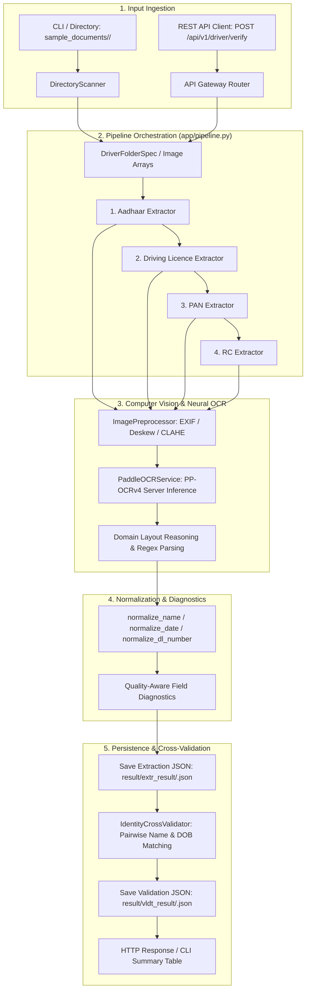

# Driver Document Verification System — Technical Architecture & Complete Reference Manual

**System Version**: 2.2 (Microservices Architecture & High-Accuracy KYC Pipeline)  
**Target Domain**: Automated Driver KYC & Identity Onboarding for Ride-Hailing Platforms (Rapido, Ola, Uber style)  
**Core Technologies**: Python 3.10+, FastAPI, Uvicorn, OpenCV, PaddleOCR (PP-OCRv4 Server Weights), Pydantic, RapidFuzz, NumPy, Pillow  

---

## 📌 Table of Contents

1. [System Architecture & Core Principles](#1-system-architecture--core-principles)
   - [1.1 Architectural Principles](#11-architectural-principles)
   - [1.2 End-to-End Verification Lifecycle](#12-end-to-end-verification-lifecycle)
   - [1.3 System Flow Architecture Diagram](#13-system-flow-architecture-diagram)
2. [Directory & Repository Structure](#2-directory--repository-structure)
3. [Deep-Dive Component Reference](#3-deep-dive-component-reference)
   - [3.1 Master Pipeline Orchestrator (`app/pipeline.py`)](#31-master-pipeline-orchestrator)
   - [3.2 Process Singleton Dependencies (`app/dependencies.py`)](#32-process-singleton-dependencies)
   - [3.3 Image Preprocessing & OCR Engine (`app/ocr/`)](#33-image-preprocessing--ocr-engine)
   - [3.4 Shared Normalization Utilities (`app/utils/normalizer.py`)](#34-shared-normalization-utilities)
   - [3.5 Document-Specific Domain Extractors (`app/services/`)](#35-document-specific-domain-extractors)
     - [Base Extractor (`base_extractor.py`)](#base-extractor)
     - [Aadhaar Extractor (`aadhaar_extractor/`)](#aadhaar-extractor)
     - [Driving Licence Extractor (`driving_license_extractor/`)](#driving-licence-extractor)
     - [PAN Card Extractor (`pan_extractor/`)](#pan-card-extractor)
     - [RC Extractor & Manufacturer Repository (`rc_extractor/`)](#rc-extractor--manufacturer-repository)
   - [3.6 Identity Cross-Validator (`app/services/identity_cross_validator/`)](#36-identity-cross-validator)
   - [3.7 Directory Scanner Service (`app/services/directory_scanner.py`)](#37-directory-scanner-service)
   - [3.8 Document Type Detector (`app/services/doc_type_detector.py`)](#38-document-type-detector)
4. [FastAPI Microservices Suite & REST API Reference](#4-fastapi-microservices-suite--rest-api-reference)
   - [4.1 API Architecture & Router Layout](#41-api-architecture--router-layout)
   - [4.2 Endpoint Specifications](#42-endpoint-specifications)
   - [4.3 Interactive Swagger UI & OpenAPI Specification](#43-interactive-swagger-ui--openapi-specification)
5. [Storage Formats & Output JSON Schemas](#5-storage-formats--output-json-schemas)
   - [5.1 Extraction JSON Schema (`result/extr_result/<driver_id>.json`)](#51-extraction-json-schema)
   - [5.2 Validation JSON Schema (`result/vldt_result/<driver_id>.json`)](#52-validation-json-schema)
6. [Production Deployment & Concurrency Architecture](#6-production-deployment--concurrency-architecture)
   - [6.1 Uvicorn Multi-Worker Process Isolation](#61-uvicorn-multi-worker-process-isolation)
   - [6.2 GPU VRAM Memory Optimization](#62-gpu-vram-memory-optimization)
7. [Usage & Execution Guide](#7-usage--execution-guide)
   - [7.1 CLI Commands](#71-cli-commands)
   - [7.2 Server Startup Commands](#72-server-startup-commands)
   - [7.3 Programmatic Python API](#73-programmatic-python-api)

---

## 1. System Architecture & Core Principles

### 1.1 Architectural Principles

The Driver Document Verification System is an enterprise-grade automated KYC and vehicle onboarding platform engineered to process real-world identity and vehicle documents:
- **Aadhaar Card** (Identity Proof & Address Verification)
- **Driving Licence (DL)** (Driving Authorization, Expiry Dates & Vehicle Categories)
- **Permanent Account Number (PAN)** (Financial / Tax Identity Verification)
- **Registration Certificate (RC)** (Vehicle Ownership, Class & Fitness Validity)

```
┌──────────────────────────────────────────────────────────────────────────────────────────┐
│                                CORE DESIGN PRINCIPLES                                    │
├──────────────────────────────────────────────────────────────────────────────────────────┤
│ 1. Driver-by-Driver Flow  : Documents are grouped and processed sequentially per driver.│
│ 2. Strict Hierarchy       : Aadhaar ──> Driving Licence ──> PAN Card ──> RC Book.        │
│ 3. Side-Isolated OCR      : Front and back images are preprocessed and OCR'd separately.│
│ 4. Spatial Reasoning      : Label-proximity bounding-box geometry over brittle regex.   │
│ 5. Semantic Validation    : Cross-field constraints (Issue Date < Expiry, Issue >= DOB). │
│ 6. Process-Level Isolation: Uvicorn multi-worker architecture with isolated GPU memory. │
│ 7. Pairwise Cross-Check   : RapidFuzz Name similarity & exact DOB matching across docs. │
│ 8. Actionable Diagnostics : Specific, human-readable explanations for any missing field.│
└──────────────────────────────────────────────────────────────────────────────────────────┘
```

---

### 1.2 End-to-End Verification Lifecycle

1. **Ingestion & Discovery**:
   - **CLI / Batch Flow**: [`DirectoryScanner`](file:///c:/Users/parik/OneDrive/Desktop/Driver_Verification/app/services/directory_scanner.py) crawls `sample_documents/`, discovers driver folders, and resolves front/back image file paths into structured `DriverFolderSpec` objects.
   - **REST API Flow**: [`gateway_router`](file:///c:/Users/parik/OneDrive/Desktop/Driver_Verification/app/api/v1/gateway_router.py) receives multipart image uploads directly via HTTP `POST /api/v1/driver/verify`.
2. **Sequential Orchestration**:
   [`Pipeline.extract_driver`](file:///c:/Users/parik/OneDrive/Desktop/Driver_Verification/app/pipeline.py) processes documents in mandatory order (`AADHAAR` $\rightarrow$ `DRIVING_LICENCE` $\rightarrow$ `PAN` $\rightarrow$ `RC`).
3. **Independent Side Preprocessing**:
   [`ImagePreprocessor`](file:///c:/Users/parik/OneDrive/Desktop/Driver_Verification/app/ocr/preprocessor.py) loads front and back images, resolves EXIF orientation tags, executes Otsu horizontal projection variance rotation correction ($0^\circ, 90^\circ, 180^\circ, 270^\circ$), performs Hough line skew correction ($<15^\circ$), assesses image quality (blur, darkness, glare), and applies adaptive LAB CLAHE / gamma enhancement.
4. **PP-OCRv4 Neural Inference**:
   [`PaddleOCRService`](file:///c:/Users/parik/OneDrive/Desktop/Driver_Verification/app/ocr/paddle_ocr.py) runs high-accuracy server weights (`ch_PP-OCRv4_det_server_infer`, `en_PP-OCRv4_rec_server_infer`, `ch_ppocr_mobile_v2.0_cls_infer`) with `rec_image_shape="3,64,320"`, extracts bounding polygon points, filters confidence, and sorts text boxes spatially (top-to-bottom, left-to-right).
5. **Domain Extraction & Spatial Layout Reasoning**:
   The designated extractor parses field data using 2D geometric proximity, RapidFuzz label matching ($\ge 85\%$), inline prefix stripping, and structural blacklist protection.
6. **Data Normalization & Diagnostic Generation**:
   Raw text is standardized via [`normalizer.py`](file:///c:/Users/parik/OneDrive/Desktop/Driver_Verification/app/utils/normalizer.py) (Dates $\rightarrow$ ISO `YYYY-MM-DD`, Sarathi DL $\rightarrow$ `SS-RR-YYYY-NNNNNNN`, RC $\rightarrow$ `SS-RR-XX-NNNN`). For unextracted fields, specific image-quality and OCR diagnostics are generated.
7. **JSON Persistence**:
   The full driver record is serialized to `result/extr_result/<driver_id>.json`.
8. **Identity Cross-Validation**:
   [`IdentityCrossValidator`](file:///c:/Users/parik/OneDrive/Desktop/Driver_Verification/app/services/identity_cross_validator/cross_validator.py) compares Name (RapidFuzz token sort ratio) and DOB (exact match) across all document pairs (Aadhaar $\leftrightarrow$ PAN, Aadhaar $\leftrightarrow$ Licence, PAN $\leftrightarrow$ Licence) and writes validation results to `result/vldt_result/<driver_id>.json`.

---

### 1.3 System Flow Architecture Diagram



---

## 2. Directory & Repository Structure

```
Driver_Verification/
│
├── app/                                       # Core Application Package
│   ├── __init__.py
│   ├── dependencies.py                       # Process-isolated Singleton Dependency Factory
│   ├── pipeline.py                           # Master Pipeline Orchestrator
│   ├── server.py                             # FastAPI Master Server & OpenAPI Specification
│   │
│   ├── api/                                  # REST API Microservices Suite
│   │   ├── __init__.py
│   │   └── v1/
│   │       ├── __init__.py
│   │       ├── gateway_router.py             # End-to-End Verification Gateway (/api/v1/driver)
│   │       ├── ocr_router.py                 # Standalone OCR & Image Quality Service (/api/v1/ocr)
│   │       ├── aadhaar_router.py             # Aadhaar Extractor Endpoint (/api/v1/aadhaar)
│   │       ├── dl_router.py                  # Driving Licence Extractor Endpoint (/api/v1/dl)
│   │       ├── pan_router.py                 # PAN Card Extractor Endpoint (/api/v1/pan)
│   │       ├── rc_router.py                  # RC Book Extractor Endpoint (/api/v1/rc)
│   │       └── validator_router.py           # Identity Cross-Validation Endpoint (/api/v1/validate)
│   │
│   ├── config/                               # System Settings & Paths
│   │   ├── __init__.py
│   │   └── settings.py
│   │
│   ├── models/                               # Data Models & Schemas (Pydantic / Dataclasses)
│   │   ├── __init__.py
│   │   ├── driver_models.py                  # Verification Results, DocumentExtractionResult
│   │   └── ocr_models.py                     # OCRResult, OCRText, BoundingBox, Point, QualityReport
│   │
│   ├── ocr/                                  # Neural OCR & Computer Vision Subsystem
│   │   ├── __init__.py
│   │   ├── config.py                         # Preprocessor & OCR Model Configuration
│   │   ├── paddle_ocr.py                     # PaddleOCR Wrapper (PP-OCRv4 Server Models)
│   │   └── preprocessor.py                   # Image Loading, Deskew, Rotation, CLAHE Enhancement
│   │
│   ├── services/                             # Domain Extraction & Business Logic
│   │   ├── __init__.py
│   │   ├── base_extractor.py                 # Base Spatial Extraction Engine
│   │   ├── directory_scanner.py              # Driver Folder Discovery & File Parsing
│   │   ├── doc_type_detector.py              # Automatic Document Classification
│   │   │
│   │   ├── aadhaar_extractor/                # Aadhaar Card Extraction Subsystem
│   │   │   ├── __init__.py
│   │   │   ├── config.py
│   │   │   ├── extractor.py
│   │   │   └── models.py
│   │   │
│   │   ├── driving_license_extractor/        # Driving Licence Extraction Subsystem
│   │   │   ├── __init__.py
│   │   │   ├── config.py
│   │   │   ├── extractor.py
│   │   │   └── models.py
│   │   │
│   │   ├── pan_extractor/                    # PAN Card Extraction Subsystem
│   │   │   ├── __init__.py
│   │   │   ├── config.py
│   │   │   ├── extractor.py
│   │   │   └── models.py
│   │   │
│   │   ├── rc_extractor/                     # RC Book Extraction Subsystem
│   │   │   ├── __init__.py
│   │   │   ├── config.py
│   │   │   ├── extractor.py
│   │   │   ├── models.py
│   │   │   └── manufacturers.py              # 100+ OEM Make/Manufacturer Database
│   │   │
│   │   └── identity_cross_validator/         # Cross-Document Identity Validation Subsystem
│   │       ├── __init__.py
│   │       ├── config.py
│   │       ├── cross_validator.py
│   │       └── models.py
│   │
│   └── utils/                                # Utility Modules
│       ├── __init__.py
│       └── normalizer.py                     # Dates, Names, DL, RC Normalization Functions
│
├── models/                                   # PaddleOCR Neural Weights (Local Directory)
│   ├── cls/ch_ppocr_mobile_v2.0_cls_infer/   # Angle Classification Model
│   ├── det_server/ch_PP-OCRv4_det_server_infer/ # High-Accuracy Text Detection
│   └── rec_server/en_PP-OCRv4_rec_server_infer/ # High-Accuracy English Recognition
│
├── sample_documents/                         # Input Driver Folders (<phone_number>/<doc_subfolders>)
├── result/                                   # Output Data & Evaluation Results
│   ├── extr_result/                          # Serialized Extracted Driver JSONs
│   ├── vldt_result/                          # Serialized Identity Validation JSONs
│   ├── calculate.py                          # Accuracy & Extraction Rate Benchmark Script
│   └── accuracy_calculator.py                # Dashboard & Metric Formatter
│
├── main.py                                   # Master CLI Execution Script
├── cross_validate.py                         # Standalone Identity Cross-Validation CLI
├── requirements.txt                          # Python Package Dependencies
└── PROJECT_DOCUMENTATION.md                  # Complete System Architecture & Reference
```

---

## 3. Deep-Dive Component Reference

### 3.1 Master Pipeline Orchestrator (`app/pipeline.py`)

The [`Pipeline`](file:///c:/Users/parik/OneDrive/Desktop/Driver_Verification/app/pipeline.py) class coordinates preprocessing, OCR, extraction, and diagnostics.

* **Key Methods**:
  - `extract_driver(driver_input, output_dir)`: Processes all 4 documents for a driver in strict sequence (`Aadhaar` $\rightarrow$ `DL` $\rightarrow$ `PAN` $\rightarrow$ `RC`) and saves the resulting JSON.
  - `extract_document(doc_spec)`: Processes front and back images independently, merges multi-side OCR results, executes domain extractors, and enriches missing fields with image quality diagnostics.
  - `extract_all_drivers(base_dir, max_workers)`: Discovers all drivers in a folder and processes them cleanly.

---

### 3.2 Process Singleton Dependencies (`app/dependencies.py`)

To prevent multiple deep-learning model instances from being loaded into GPU VRAM per worker process, [`app/dependencies.py`](file:///c:/Users/parik/OneDrive/Desktop/Driver_Verification/app/dependencies.py) implements the **Process-Level Singleton Pattern**:
- `get_pipeline()`: Returns the worker's shared `Pipeline` instance.
- `get_ocr_service()`: Returns the worker's shared `PaddleOCRService`.
- `get_preprocessor()`: Returns the shared `ImagePreprocessor`.
- `get_cross_validator()`: Returns the shared `IdentityCrossValidator`.

---

### 3.3 Image Preprocessing & OCR Engine (`app/ocr/`)

#### Preprocessing Pipeline (`preprocessor.py`):
1. **EXIF Orientation Correction**: Rotates mobile phone camera uploads according to orientation metadata tags.
2. **Document Rotation Detection ($0^\circ, 90^\circ, 180^\circ, 270^\circ$)**: Calculates horizontal projection profile variance on Otsu-binarized edges. The orientation with maximum variance corresponds to horizontal text lines.
3. **Hough Line Deskew ($<15^\circ$)**: Detects text line angles and deskews the document.
4. **Quality Assessment**:
   - Blur detection via Laplacian variance (threshold: `< 100.0`).
   - Brightness assessment in HSV space (dark: `< 60.0`, bright: `> 200.0`).
   - Glare detection (% of saturated pixels `> 240`).
5. **Adaptive Image Enhancement**: Applies adaptive LAB CLAHE (Contrast Limited Adaptive Histogram Equalization) and gamma correction.

#### Neural OCR Inference (`paddle_ocr.py`):
- Powered by **PP-OCRv4 Server Models** with GPU acceleration.
- Confidence threshold filtering (`min_confidence = 0.70`).
- Text boxes are spatially indexed and sorted top-to-bottom and left-to-right.

---

### 3.4 Shared Normalization Utilities (`app/utils/normalizer.py`)

- **`normalize_name(text)`**: Converts Indian names to Title Case, collapses redundant spaces, and strips special characters while preserving single letters and initials.
- **`normalize_date(text)` / `normalize_dob(text)`**: Parses Indian and international date formats (`DD-MM-YYYY`, `DD/MM/YYYY`, `YYYY-MM-DD`, `DD Mon YYYY`, and compact glued dates) into standard ISO `YYYY-MM-DD`.
- **`normalize_dl_number(text)`**: Standardizes All-India Sarathi driving licence numbers into `SS-RR-YYYY-NNNNNNN`.
- **`normalize_rc_number(text)`**: Standardizes Indian vehicle registration numbers into `SS-RR-XX-NNNN`.

---

### 3.5 Document-Specific Domain Extractors (`app/services/`)

#### Base Extractor (`base_extractor.py`)
Provides geometric bounding box spatial reasoning algorithms:
- `find_value_near_label(texts, keywords, max_distance)`: Finds the text value closest to a given label box (preferring right-adjacent or immediately below).
- `_clean_field_value(text)`: Strips punctuation, colons, and structural prefixes.

#### Aadhaar Extractor (`aadhaar_extractor/`)
- **Aadhaar Number**: Matches 12-digit Verhoeff-compliant format (`\b\d{4}\s\d{4}\s\d{4}\b`).
- **Full Name**: Spatial reasoning extracting name lines immediately preceding Father/Care-of or DOB markers.
- **DOB & Gender**: Matches `DOB`, `Date of Birth`, `जन्म तिथि` labels; standardizes `MALE` / `FEMALE`.
- **Address**: Extracted from back-side OCR text following `Address:` or `To:` markers.

#### Driving Licence Extractor (`driving_license_extractor/`)
- **Licence Number**: Strict regex matching standard Sarathi formats (`SS-RR-YYYY-NNNNNNN` or `SSRR-YYYYNNNNNNN`).
- **Date of Birth**: Fuzzy label matching (`DATE OF BIRTH`, `0T BRTH`, `DOB`) with negative guards protecting against `"Date of First Issue"` or validity dates.
- **Issue & Expiry Dates**: Spatial and table-aware date resolution matching validity labels (`VALID UPTO`, `VALID TILL`, `ISSUE DATE`).
- **Vehicle Classes**: Multi-side union identifying all authorized categories (`MCWG`, `LMV`, `TRANS`, `3W-CAB`, `HMV`, `HPMV`, `LMV-NT`).

#### PAN Card Extractor (`pan_extractor/`)
- **PAN Number**: Strict 10-character alphanumeric regex (`[A-Z]{5}[0-9]{4}[A-Z]`).
- **Full Name & Father's Name**: Extracted using positional lines above DOB and below Government of India headers.
- **Date of Birth**: Glued-token and label-proximity date extraction.

#### RC Extractor (`rc_extractor/`)
- **Registration Number**: Standard Indian vehicle registration formats.
- **Owner Name**: Extracted from owner label proximity.
- **Vehicle Class & Model**: Matched against a repository of 100+ OEM vehicle manufacturers.
- **Registration & Validity Dates**: Registration date and fitness validity expiry.
- **Confidence Scoring**: Field-level confidence calculation.

---

### 3.6 Identity Cross-Validator (`app/services/identity_cross_validator/`)

Performs pairwise identity cross-verification across all three identity documents:
1. **Aadhaar $\leftrightarrow$ PAN**
2. **Aadhaar $\leftrightarrow$ Driving Licence**
3. **PAN $\leftrightarrow$ Driving Licence**

#### Matching Rules:
- **Name Verification**: RapidFuzz Token Sort Ratio ($\ge 75\%$ = `MATCH`, $50\%-74\%$ = `REVIEW`, $<50\%$ = `MISMATCH`).
- **DOB Verification**: Exact ISO date comparison (`MATCH` / `MISMATCH` / `MISSING`).
- **Overall Decision**: Consolidates pairwise results into `overall_name_status`, `overall_dob_status`, and `overall_status` (`MATCHED`, `REVIEW`, `MISMATCH`).

---

## 4. FastAPI Microservices Suite & REST API Reference

The platform provides a complete REST API suite running on FastAPI with interactive OpenAPI documentation.

### 4.1 API Architecture & Router Layout

```
FastAPI Server (app/server.py :8000)
 │
 ├── /api/v1/driver/verify          (Master Gateway Service)
 ├── /api/v1/ocr/extract            (OCR & Image Quality Microservice)
 ├── /api/v1/aadhaar/extract        (Aadhaar Card Microservice)
 ├── /api/v1/dl/extract             (Driving Licence Microservice)
 ├── /api/v1/pan/extract            (PAN Card Microservice)
 ├── /api/v1/rc/extract             (RC Book Microservice)
 ├── /api/v1/validate/cross-verify  (Identity Cross-Validation Microservice)
 ├── /health                        (System Health Check)
 └── /docs                          (Interactive Swagger UI)
```

---

### 4.2 Endpoint Specifications

#### 1. Master Gateway Verification
* **Endpoint**: `POST /api/v1/driver/verify`
* **Content-Type**: `multipart/form-data`
* **Parameters**:
  - `driver_id` *(string, required)*: Unique identifier (e.g. phone number).
  - `aadhaar_front` *(file, optional)*: Aadhaar front image.
  - `aadhaar_back` *(file, optional)*: Aadhaar back image.
  - `licence_front` *(file, optional)*: DL front image.
  - `licence_back` *(file, optional)*: DL back image.
  - `pan_front` *(file, optional)*: PAN front image.
  - `pan_back` *(file, optional)*: PAN back image.
  - `rc_front` *(file, optional)*: RC front image.
  - `rc_back` *(file, optional)*: RC back image.
* **Response**: Returns full extraction data for all 4 documents and identity cross-validation result.

#### 2. Standalone OCR Engine Service
* **Endpoint**: `POST /api/v1/ocr/extract`
* **Content-Type**: `multipart/form-data`
* **Parameters**: `file` *(file, required)*, `min_confidence` *(float, optional)*, `fix_orientation` *(bool)*, `enhance` *(bool)*.
* **Response**: Extracted text lines, polygon coordinates, confidence scores, and image quality metrics (blur, brightness, glare).

#### 3. Aadhaar Extractor Service
* **Endpoint**: `POST /api/v1/aadhaar/extract`
* **Parameters**: `front_image` *(file, required)*, `back_image` *(file, optional)*.
* **Response**: Aadhaar number, cardholder name, DOB, gender, and address.

#### 4. Driving Licence Service
* **Endpoint**: `POST /api/v1/dl/extract`
* **Parameters**: `front_image` *(file, required)*, `back_image` *(file, optional)*.
* **Response**: DL number, name, DOB, issue date, expiry date, and vehicle classes.

#### 5. PAN Card Service
* **Endpoint**: `POST /api/v1/pan/extract`
* **Parameters**: `front_image` *(file, required)*, `back_image` *(file, optional)*.
* **Response**: PAN number, name, father's name, and DOB.

#### 6. RC Service
* **Endpoint**: `POST /api/v1/rc/extract`
* **Parameters**: `front_image` *(file, required)*, `back_image` *(file, optional)*.
* **Response**: Registration number, owner name, vehicle class, registration date, validity, and confidence metrics.

#### 7. Identity Cross-Validator Service
* **Endpoint**: `POST /api/v1/validate/cross-verify`
* **Content-Type**: `application/json`
* **Body**: Extraction JSON data.
* **Response**: Pairwise Name/DOB similarity breakdown and overall decision.

#### 8. Health Check
* **Endpoint**: `GET /health`
* **Response**: System operational status, GPU availability, and model configurations.

---

### 4.3 Interactive Swagger UI & OpenAPI Specification

When the server is running, navigate to **`http://127.0.0.1:8000/docs`** to test all microservices interactively via Swagger UI:

```
http://127.0.0.1:8000/docs   ──> Swagger UI (Interactive API Testing)
http://127.0.0.1:8000/redoc  ──> ReDoc (API Specification Documentation)
```

---

## 5. Storage Formats & Output JSON Schemas

### 5.1 Extraction JSON Schema (`result/extr_result/<driver_id>.json`)

```json
{
  "driver_id": "6355528465",
  "documents": {
    "aadhaar": {
      "document_type": "AADHAAR",
      "status": "EXTRACTED",
      "warning": null,
      "data": {
        "aadhaar_number": "6639 3925 6763",
        "full_name": "Gohil Karan Vallabhbhai",
        "date_of_birth": "1999-06-24",
        "gender": "MALE",
        "field_diagnostics": {}
      }
    },
    "licence": {
      "document_type": "DRIVING_LICENCE",
      "status": "EXTRACTED",
      "warning": null,
      "data": {
        "licence_number": "GJ-30-2026-0005165",
        "full_name": "Gohil Karan Vallabhbhai",
        "date_of_birth": "1999-06-24",
        "issue_date": "2026-07-13",
        "expiry_date": "2039-06-23",
        "vehicle_classes": ["MCWG", "LMV"],
        "field_diagnostics": {}
      }
    },
    "pan": {
      "document_type": "PAN",
      "status": "PARTIAL",
      "warning": "Partial document (missing front or back image)",
      "data": {
        "pan_number": "CJZPG1395J",
        "full_name": "Gohil Karan Vallabhbhai",
        "father_name": "Vallabhbhai Mohanbhai Gohil",
        "date_of_birth": "1999-06-24",
        "field_diagnostics": {}
      }
    },
    "rc": {
      "document_type": "RC",
      "status": "EXTRACTED",
      "warning": null,
      "data": {
        "registration_number": "GJ-05-MC-5568",
        "owner_name": "MANUBHAI",
        "vehicle_type": "SOLO+PILL.RIDER",
        "date_of_registration": "2015-03-23",
        "registration_validity": "2030-03-22",
        "confidence_scores": {
          "registration_number": 0.98,
          "owner_name": 0.99,
          "vehicle_type": 0.96,
          "date_of_registration": 0.96,
          "registration_validity": 0.96
        },
        "overall_confidence": 0.97,
        "field_diagnostics": {}
      }
    }
  }
}
```

---

### 5.2 Validation JSON Schema (`result/vldt_result/<driver_id>.json`)

```json
{
  "driver_id": "6355528465",
  "validation": {
    "aadhaar_vs_pan": {
      "name": {
        "aadhaar": "Gohil Karan Vallabhbhai",
        "pan": "Gohil Karan Vallabhbhai",
        "similarity": 100.0,
        "status": "MATCH"
      },
      "date_of_birth": {
        "aadhaar": "1999-06-24",
        "pan": "1999-06-24",
        "status": "MATCH"
      },
      "status": "MATCH"
    },
    "aadhaar_vs_licence": {
      "name": {
        "aadhaar": "Gohil Karan Vallabhbhai",
        "licence": "Gohil Karan Vallabhbhai",
        "similarity": 100.0,
        "status": "MATCH"
      },
      "date_of_birth": {
        "aadhaar": "1999-06-24",
        "licence": "1999-06-24",
        "status": "MATCH"
      },
      "status": "MATCH"
    },
    "pan_vs_licence": {
      "name": {
        "pan": "Gohil Karan Vallabhbhai",
        "licence": "Gohil Karan Vallabhbhai",
        "similarity": 100.0,
        "status": "MATCH"
      },
      "date_of_birth": {
        "pan": "1999-06-24",
        "licence": "1999-06-24",
        "status": "MATCH"
      },
      "status": "MATCH"
    },
    "overall_name_status": "MATCHED",
    "overall_dob_status": "MATCHED",
    "overall_status": "MATCHED"
  }
}
```

---

## 6. Production Deployment & Concurrency Architecture

### 6.1 Uvicorn Multi-Worker Process Isolation

In production, deep learning models (such as PaddleOCR's C++ detection and recognition predictors) must be isolated at the **process level** to prevent GPU memory race conditions and tensor corruption.

```
                  ┌─────────────────────────────────────────┐
                  │          Uvicorn Master Process         │
                  │              (Port 8000)                │
                  └────────────────────┬────────────────────┘
                                       │
            ┌──────────────────────────┴──────────────────────────┐
            ▼                                                     ▼
┌───────────────────────┐                             ┌───────────────────────┐
│   Worker Process 1    │                             │   Worker Process 2    │
│  ┌─────────────────┐  │                             │  ┌─────────────────┐  │
│  │ 1x Pipeline     │  │                             │  │ 1x Pipeline     │  │
│  │ 1x PaddleOCR    │  │                             │  │ 1x PaddleOCR    │  │
│  └─────────────────┘  │                             │  └─────────────────┘  │
│  (Isolated GPU Memory)│                             │  (Isolated GPU Memory)│
└───────────────────────┘                             └───────────────────────┘
```

- Each worker process initializes **exactly one** model instance via [`app/dependencies.py`](file:///c:/Users/parik/OneDrive/Desktop/Driver_Verification/app/dependencies.py).
- Requests are handled in parallel without GPU race conditions or memory collision.

---

### 6.2 GPU VRAM Memory Optimization

- **Single Model Footprint**: ~1.2 GB – 1.5 GB VRAM.
- **2 Workers**: ~2.5 GB – 3.0 GB VRAM (Recommended for local GPUs / 4GB-8GB VRAM).
- **4 Workers**: ~5.0 GB – 6.0 GB VRAM (Recommended for cloud GPU instances / 16GB+ VRAM).

---

## 7. Usage & Execution Guide

### 7.1 CLI Commands

#### 1. Batch Driver Extraction
Extracts all drivers in `sample_documents/` and outputs JSONs to `result/extr_result/`:
```bash
python main.py
```

#### 2. Single Driver Extraction
```bash
python main.py sample_documents/6355528465
```

#### 3. Identity Cross-Validation
Cross-validates all extracted JSON records and outputs results to `result/vldt_result/`:
```bash
python cross_validate.py
```

#### 4. Accuracy Benchmark Dashboard
```bash
python result/calculate.py
```

---

### 7.2 Server Startup Commands

#### Development Mode:
```powershell
uvicorn app.server:app --workers 2 --host 127.0.0.1 --port 8000
```

#### Production Server Mode:
```powershell
uvicorn app.server:app --workers 4 --host 0.0.0.0 --port 8000 --timeout-keep-alive 75
```

---

### 7.3 Programmatic Python API

```python
from app.pipeline import Pipeline
from app.services.identity_cross_validator.cross_validator import IdentityCrossValidator

# 1. Initialize Pipeline
pipeline = Pipeline()

# 2. Extract Driver
driver_result = pipeline.extract_driver("sample_documents/6355528465")
print(driver_result.display(detailed=True))

# 3. Cross-Validate Identity
validator = IdentityCrossValidator()
cross_val = validator.validate_driver_json(driver_result.to_dict())

print(f"Overall Identity Decision: {cross_val.overall_status}")
print(f"Name Match Status        : {cross_val.overall_name_status}")
print(f"DOB Match Status         : {cross_val.overall_dob_status}")
```
